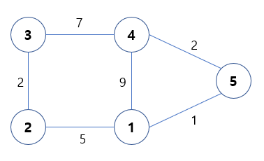

[플로이드-워셜(Floyd-Warshall) 알고리즘](https://chanhuiseok.github.io/posts/algo-50/)
[플로이드 와샬 알고리즘](https://wikidocs.net/206948)
{:.note title="출처 및 참고"}

* this unordered seed list will be replaced by the toc
{:toc}

# 플로이드 워셜 알고리즘이란?
플로이드-워셜 알고리즘은 다익스트라와 달리 **한번 실행해서 모든 노드 간 최단 경로를 구할 수 있음**, 다익스트라와 달리 음의 간선도 가능

> 다익스트라(하나의 정점에서 다른 모든 정점까지의 최단거리를 구하는 알고리즘(S.S.S.P(Single Source Shortest Path)))

# 점화식
$$D_{ab} = min(D_{ab}, D_{ak} + D_{kb})$$

# 과정
모든 노드 간의 최단거리를 구해야하므로 2차원 인접 행렬을 구성

알고리즘은 여러 round로 구성

round마다 각 경로에서 새로운 중간 노드로 사용할 수 있는 노드를 선택하고, **더 짧은 길이를 선택해서 줄이는 과정 반복**



# 소스코드로 구현
시간복잡도: **O(n^3)**

그래프의 크기가 작아 세제곱 시간 알고리즘을 적용해도 문제가 풀릴 때만 사용 가능

```python
for i in range(1, n + 1):
    for j in range(1, n + 1):
        if i == j:
            dist[i][j] = 0
        elif adj[i][j]:
            dist[i][j] = adj[i][j]
        else:
            dist[i][j] = INF
```

adj에 저장된 인접 행렬의 값을 활용하여 최단 거리 배열인 dist 배열을 초기화

- 자기자신: 0
- 간선 사이의 거리: 입력된 값
- 그 외: 무한대

```python
for k in range(1, n + 1):
    for i in range(1, n + 1):
        for j in range(1, n + 1):
            dist[i][j] = min(dist[i][j], dist[i][k] + dist[k][j])
```

- **이후, 각 라운드별로 중간 노드가 될 노드 번호를 for 바깥의 k로 삼고**
- 내부 이중 for에는 i, j를 통해 각 노드별 모든 거리를 살펴보면서 k를 중간 노드로 삼을 때와 아닐 때의 값을 비교해 **더 작은 값으로 업데이트**