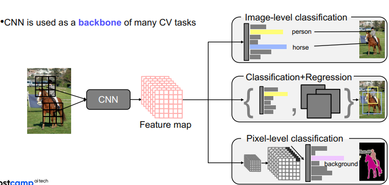

[SENet(Squeeze and excitation networks](https://jayhey.github.io/deep%20learning/2018/07/18/SENet/)
BoostCampAITECH
{:.note title="출처 및 참고"}

* this unordered seed list will be replaced by the toc
{:toc}

**classifier: 어떤 물체가 영상 속에 들어있는지 분류하는 매핑**

- **분류기를 어떻게 구현?**
    - 가장 이상적인 모델은 이 세상의 모든 데이터를 가지고 있는 모델
    - 그런 모델의 경우가 분류가 검색으로 바뀜
    - K-NN
        - 질의 데이터가 들어오면 그 데이터 근방에 포진한 k개의 이웃 데이터를 DB에서 찾고 데이터를 label을 기반으로 분류하는 알고리즘
    - 하지만 모든 데이터를 가질 수 없고 시간 복잡도와 공간복잡도가 O(N) → 불가능

- **single layer neural network(=fully connected layer networks)**
    - **모든 픽셀을 서로 다른 가중치로 내적 후 nonlinear activation function을 통해 분류 score로 출력하는 간단한 모델**
    - 문제
        - 내적한 weight matrix를 영상 구조에 맞춰 간단하게 reshape하고 시각화해보면 평균 영상처럼 보이는 걸 알 수 있는데
        1. **layer가 단순해서 평균 영상 이외에 다르게 표현할 수 없음**
        2. **test  시점에서 문제가 발생**
            - 학습 시에는 해당 영상에 대한 대표적인 패턴을 학습
            - 실제 테스트에서 조금이라도 template의 위치나 scale이 안맞으면 다른 결과를 냄

- **convolution neural network**(=locally connected neural networks) = CNN
    - fully connected layer: 하나의 특징을 뽑기 위해 모든 픽셀을 고려
    - **locally connected layer: 하나의 특징을 뽑을 때 영상의 공간적인 특성을 고려해서 국부적인 영역을 고려**
    - **더 적은 파라미터를 가지고 특징을 추출할 수 있고 overfitting을 방지**
    - **sliding window 기법으로 필터가 움직이면서 특징을 추출하기 때문에 물체의 위치나 스케일이 바뀌어도 좋은 성능을 낼 수 있음 → 영상 분류에 적합**
    - 이런 영상에 적합한 특징으로 **CNN은 다양한 CV task의 기본적인 backbone network**로 많이 사용
    - 영상의 특징을 추출하는 backbone netowrk위에 target task의 head를 적합하게 디자인해서 사용
        
        
        

이러한 테스크 중에서 **image-level classification의 초점**에 맞춰서 강의 진행

# AlexNet

- 간단한 CNN 아키텍쳐
- Conv-Pool-LRN-Conv-Pool-LRN-Conv-Conv-Conv-Pool-FC-FC-FC
- Bigger, Trained with ImageNet, ReLU, dropout, GPU가 모자라서 절반씩 나눠서 GPU에 올림
- maxpooling된 map이 linear layer로 가기 위해서는 flatten 작업이 필요했음
- **LRN: Local Response Normlization**
    - **Lateral inhibition: 흥분한 뉴런이 주변 뉴런을 억제하는 능력(한 영역에 있는 신경 세포가 상호 간 연결되어 있을 때 한 그 자신의 축색이나 자신과 이웃 신경세포를 매개하는 중간신경세포를 통해 이웃에 있는 신경 세포를 억제하려는 경향)**
    - **LRN: 흥분한 뉴런 주변을 국소적으로 정규화**
        - **사용이유? ReLU는 양수의 방향으로 입력의 값을 그대로 사용하기에 Conv, Pooling시에 매우 높은 하나의 픽셀 값이 주변의 픽셀에 영향을 미침, 이런 부분을 방지하기 위해서 activationmap의 같은 위치에 있는 픽셀끼리 정규화 → AlexNet에서 사용되는 LRN → 현재는 Batch Normlzation**
- 11x11 convolution filter
    - receptive filed를 크게 만들어주기 위해서 큰 필터를 사용

# VGGNet

1. 깊은 layer 구조(16, 19 layers)
2. 간단한 구조로 되어 있으며 3x3 필터와 2x2 max pooling만 사용
    1. Deeper architecture
    2. Simpler architecture
    3. Better performance
    4. Better generalization
- **작은 필터라도 깊게 쌓으면 receptive field가 커져 더 좋은 성능을 낼 수 있었음**

# 중간 정리

- AlexNet→VGGNet으로 발전하면서 **더 깊은 layer를 쌓는 것이 더 좋은 성능을 낸다는 것을 확인**
- 더 깊으면 더 복잡한 관계에 대해 학습이 가능하고 **더 큰 receptive filed를 참고할 수 있기에**
- 하지만 **layer를 깊게 쌓으면 gradient들이 누적되면서 gradient exploding이 일어나거나 너무 작아져서 gradient vanishing문제가 발생**
- 또한 깊어질수록 계산 복잡도가 높아져서 빠르게 연산하려면 더 좋은 GPU가 필요
- 이전에는 **모델 파라미터 수가 많아서 overfitting problem이 생길거라고 생각했지만 실제로는 Degradation problem이 문제**
    - 모델의 레이어가 깊어졌을 때 모델이 수렴했음에도 불구하고 **오히려 레이어 개수가 적을 때보다 모델의 training/test error가 더 커지는 현상이 발생.** 이것은 오버피팅 때문이 아니라 네트워크 구조상 레이어를 깊이 쌓았을 때 최적화가 잘 안되기 때문에 발생하는 문제임.

# GoogLeNet

- inception module 제안
    - **하나의 layer에 다양한 크기의 필터를 적용해서 여러 측면으로 activation을 관찰하기 위해 사용 → 수평 확장**
    - 그렇게 나온 결과들을 채널 축으로 쌓아서 다음 블록으로 넘김
    - 한 층에 여러 필터를 사용하게 되면 계산 복잡도나 용량이 매우 커짐 → **1x1 conv layer**
    - **필터를 적용하기 전에 1x1 conv layer를 통해 채널의 차원을 줄임**
    - max pooling 후에도 1x1 conv lyaer를 적용
    - **공간의 크기는 변하지 않고 채널 수만 변경**
        
        
        

- 아키텍쳐 구성요소
    
    
    
    - stream network: vanilla convolution networks
    - staked inception modules
    - **auxiliary classifiers**
        - **layer를 깊게 쌓으면 gradinet vanishing 문제가 발생하는데 이를 해결하기 위해서 중간 중간에 gradient를 넣어주는 것**
        - 중간 레이어에 작은 clasifier를 달아서 별도의 loss를 계산하고 하위 레이어까지 gradinet가 잘 전달되게 함
        - 학습 할 때만 사용하고 테스트할 때는 사용하지 않음
    
    
    
    averagepool → 1x1 conv → fc → softmax와 같이 lower layer에 gradinet를 추가로 주입
    
    - classifier output(a single FC layers)

# ResNet

- 100개가 넘는 layer를 쌓았고, layer의 depth가 성능에 중요한 영향을 준다는 것
- 이전에도 깊게 쌓으려 했지만 **Degradaton problem 때문에 실패**
    
    
    
    - as the network depth increases, accuracy gets saturated ⇒ degrade rapidly
    - 오버피팅 문제가 아닌 optimization
- **연구 가설(Plain → Residual)**
    - x에서 곧바로 H(x)를 학습하려고 하면 layer가 깊어서 복잡하기 때문에 학습하기 더 어려울 것
    - 한번에 찾지말고 현재 identity 외에 남은 부분 F(x)만 모델링해서 학습하면 부담이 덜할 것이니까 잘 될 것이다.
- 학습해야 하는 대상이 Residual function만 남기 때문에 어떻게 보면 분할 정복이 가능
- Residual block을 통해 H(x)만 구현하면 적어도 x를 보존하려는 노력은 하지 않아도 됨

**Solution: Shortcut Connection(Skip Connection)**

- **Use layers to fit a residual mapping** instead of directly fitting a desired underlying mapping
- the vanishing gradient problem is solved by shortcut connection
- don’t just stack layers up, **instead use shortcut connection!**

**Analysis of residual connection**

- During traning, gradients are mainly **from relatively shorter paths**
- Residual network have $O(2^n)$ implicit paths connecting input and output, and **adding a block doubles the number of paths**

(a) Conventional 3-block residual network                                                (b)  Unraveled view of (a)

## Architecture

- 7x7 conv layer 1개로 시작
- He initialization → residual block에서 x와 f(x)를 더해주는데 일반적인 초기화를 쓰면 이 값이 매우 커짐, 이에 적합한 방법임
- stack residual blocks, every residual block has two 3x3 conv layers.. **batch norm after every conv layer!**
- doublling the number of filter and spatially down-sampling by stride 2 instead of spatial pooling
- only a single FC layer for output classes

# Beyond ResNets

ResNet에서는 레이어의 입력과 출력을 요소별로 더함

## DenseNet

- In the Dense blocks, every output of each layer is **connected along the channel axis**
    - Alleviate vanishing gradient problem
    - Strengthen feature propagation
    - Encourage the resue of features(특징 재사용 촉진)
- resnet은 더하기, densenet은 concat으로 신호를 그대로 보존하며 채널이 늘어나서 메모리, computational complexity(계산 복잡도)가 늘어남
- 하지만 feature의 정보를 그대로 보존하여 상위 layer에서 하위 layer를 참조해야 할 때 필요한 정보를 꺼내서 사용

## SENet

- Attention across channels
- **채널 간 상호 의존성을 모델링하여 채널별 응답을 재조정**

### Squeeze(압축)

- **capturing distributions of channel-wise responses by global average pooling**
1. 각 채널별 가중치를 계산하기 위해서는 일단 1차원으로 만듦
2. 예를 들어 3차원이 있으면 [0.2, 0.4, 0.3]으로 표기해야 가중치를 나타낼 수 있음
3. squeeze는 각 채널을 1차원으로 만드는 역할(압축)하고 conv 연산을 통해 생성된 feature map을 입력으로 받음
4. HxWxC 크기의 feature map을 **global average pooling 연산**을 통해서 (1x1xC)로 압축 → 각 채널의 공간 정보를 없애고 각 채널의 분포를 구함
5. 피처맵의 한 채널에 해당하는 픽셀 값을 모두 다 더하고, HxW로 나눠서 1x1x1로 압축
6. **피쳐맵은 C개의 채널을 갖고 있으므로 다 연결하면 (1x1xC)가 되고 해당 벡터는 excitation으로 전달**

> global average pooling(GAP)를 사용하면 **global spatial information을 channel descriptor로 압출 시킬 수 있음**
> 

### Excitation(재조정)

s가 채널별 중요도
δ가 ReLU, σ가 sigmoid 함수, W_1과 W_2는 Fully connection layer(ReLU 함수로 비선형성을 추가하고, Sigmoid 함수로 0과 1 사이의 값으로 변환함)
**reduction ratio r를 통해서 W_1의 노드 수를 줄이고, W_2에서 다시 피쳐맵의 수 C만큼 증가**

만약 feature map의 수가 C이고, r값이 4라면 위와 같이 FC layer가 생김

모든 함수를 거쳐 나온 값을 아래 수식처럼 기존 네트워크에 있던 GAP 이전의 C개의 피쳐맵에 각각 곱해줌

excitation operation을 거친 스케일 값 s들이 모두 0과 1 사이의 값을 가지므로 채널의 중요도에 따라 스케일됨

- **gating channels by channel-wise attention weights obtained by a FC layer**
1. fc layer 하나를 통해 채널 간의 연관성(의존성) 고려
2. (1x1xC) 벡터가 들어오면 W를 거쳐서 채널 간의 연관성을 고려해 채널 별로 하나씩 attention score를 생성
3. 나온 attention으로 입력 attention과 weight를 활용하여 activation을 rescaling
4. 중요도가 낮은 것은 닫히도록 하고 높은 것은 강하게 함

## EfficientNet

- building deep, wide, and high resolution networks in an efficient way

## **Deformable(변형 가능한) convolution**

사람이나 동물을 인식할 때 팔, 다리 위치가 바뀌어서 이를 고려하기 위해 제안

고정된 크기의 weight가 존재하고 2D offset map을 추정하기 위한 branch가 따로 결합

- Irregular convolution을 위한 2D 공간적 오프셋 예측
- 2D 공간적 오프셋을 사용한 불규칙한 그리드 샘플링
- 표준 CNN과 2D 오프셋을 사용한 그리드 샘플링으로 구현

input → conv → offset filed를 생성하게 되고 offset filed에 따라 weight들을 벌려주며 벌려진 위치에 맞게끔 irregular한 sampling을 통해 activation과 irregular한 필터를 내적해서 한 값을 도출, 즉. irregular한 shape를 갖는 conv 연산

