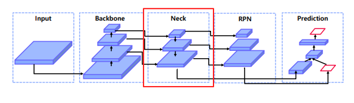

[ASPP(Atrous Spatial Pyramid Pooling)](https://blog.naver.com/h22hyeon/222247290992)
BoostCampAITECH
{:.note title="출처 및 참고"}

* this unordered seed list will be replaced by the toc
{:toc}

# Neck

기존의 RPN은 backbone을 통과한 마지막 feature map만 사용하여 **RPN을 통한 ROI 추출 → 중간에 있는 feature들을 사용하기 위해 Neck 등장**

## **왜 필요한가?**

- 다양한 크기의 객체를 더 잘탐지하기 위해서
- **하위 level의 feature는 semantic이 약하므로 상대적으로 semantic이 강한 상위 feature와의 교환이 필요**
    
    
    

## 기존 방식

1. **Featurized image pyramid**:
    **입력 이미지의 크기를 resize하여 다양한 scale의 이미지를 네트워크에 입력하는 방법,** 속도가 매우 느리며, 메모리를 지나치게 많이 사용한다는 문제

2. **Single feature map**:
    **단일 입력 이미지를 CNN에 입력하여 단일 feature map을 통해 object detection을 수행하는 방법,** 속도가 매우 빠르지만 성능이 떨어짐

3. **Pyramidal feature hierarchy**:
    **CNN에서 미리 지정한 convolution layer마다 feature map을 추출하여 detection하는 방법,** multi-scale feature map을 사용하기 때문에 성능이 높다는 장점이 있지만 feature map 간 해상도 차이로 인해 학습하는 representation에서 차이인 semantic gap이 발생한다는 문제
    

# Feature Pyramid Network(FPN)

- high level에서 low level로 semantic  정보 전달 필요하므로 **top-down path way를 추가**
    - low level = early stage = bottom
    - high level = late stage = top

- **Lateral connections 방식으로 두 개의 feature merge**
    
    
    
    - 두 개의 feature의 shape이 달라서
    - **bottom-up 과정에서 나온 feature map은 1x1 conv layer를 통과해 channel size를 늘려줌**
        
        
        
    - **top-down에서 나온 feature은 upsampling을 통해 width와 height을 높여줌(Nearset Neighbor Upsampling 사용)**
        
        
        
    - Nearest Neighbor Upsampling
        
        
        

## Pipeline

Backbone: ResNet

ResNet에는 총 4개의 stage가 있고, pooling으로 w, h가 절반으로 줄어듦

각 feature map에 3x3 conv 연산을 적용하고 [p5, p4, p3, p2]를 얻음

## Contribution & Summary

- 여러 scale의 물체를 탐지하기 위해서 설계
- 이를 달성하기 위해서는 여러 크기의 feature를 사용해야할 필요가 있음

- Bottom up(backbone)에서 다양한 크기의 fature map 추출
- 다양한 크기의 feature map에서 semantic을 교환하기 위해 top-down 방식 사용

# Path Aggregation Network(PANet)

Top-down 과정에서 nearest neighbor upsampling 방식을 사용하는데 이 때 low-level의 feature가 high-level의 feature로 제대로 전달될 수가 없음

**→ 초록색처럼 Bottom-up을 추가해주어 온전하게 high-level로 전달되어 큰 객체를 검출하는 경우에도 low-level 정보를 활용**

## Adaptive Feature Pooling

Bottom-up Path Augmentation에서 얻은 feature map은 RPN에 적용되어 RoI 생성, 생성된 RoI는 RoI Align을 거쳐 일정 크기의 벡터가 생성

생성된 feature vector는 max로 결합하고 fc layer를 통해 class, box 예측

# After FPN

## DetectoRS

### Recursive Feature Pyramid

FPN을 recursive하게 진행, recursive하게 진행하기에 학습 속도가 느림

**FPN에서의 output feature**

- $B_i$를 각 bottom-up backbone의 i-stage
- $F_i$를 i번째 top-down FPN
- $f_i$를 i-stage FPN의 output

**RFP에서의 output feature**

- FPN에서의 output features $f_i$를 추가
- $R_i$: bottom-up backbone으로 연결해 주기 전에 가하는 feature transformation

### ASPP(Atrous Convolution Pyramid Pooling)

connecting module로 ASPP를 사용함

**보통은 layer가 깊어질수록 feature map의 size가 작아지며 input image의 정보를 놓칠 수 있음 → 해결하기 위해서 제안됨**

**Atrous Convolution:** Convolution layer에 dilation rate라는 개념이 추가된 것

dilaation rate는 각 kernel pixel 사이의 간격을 의미(비어있는 kernel pixel의 값은 0)

Atrous convolution (dilation rate = 1, 2, 3)

위 그림처럼 3x3 kernel을 dilation rate=2와 함께 사용하게 되면 오직 9개의 파라미터를 사용하여 5x5 kernal이 연산하는 영역과 동일한 범위를 연산

**ASPP는 SPP의 atrous 버전:** atrous pooling을 pyramid처럼 쌓는 것, atrous convolution을 통해서 receptive field를 확장했다면 **ASPP에서는 다른 dilation rate(filter 사이의 간격)를 가진 atrous pooling layer를 중첩하여 multi scale에 더 잘 반응할 수 있도록 함**

**DeepLab에서의 ASPP는 다음과 같음**

DeepLab 모델은 먼저 backbone(VGG, DeseNet, ResNet) architecture에서 feature map을 추출하고, feature map의 크기를 조정하기 위해서 backbone의 마지막 layer에서 atrous convolution을 수행

그리고 ASPP network는 backbone에서 추출된 feature에 더해짐

이런 ASPP network의 출력은 1x1 convolution을 통해서 뒷단으로 전달

- atrous convolution을 사용하지 않은 **DCN 구조**는 long range information을 잡아내는 데에는 유용하지만 feature map이 매우 축소되어 image feature를 요약에 좋음 → **semantic segmentation과 같은 spatial information을 요구하는 작업에는 부적절**
- atrous convolution을 이용한 경우 각각의 scale에서 feature를 잡아내어 deep한 network를 구축하고 spatial한 정보를 유지함 → **각 Block에서 증가되는 dilation rate 덕분에** → **semantic segmentation에 도움을 줌, 각각의 dilation rate는 filter가 다른 영역을 커버하게 해줌, 결과적으로 fully convolution network에서 multi scale object를 커버할 수 잇게 함**

**ASPP는 multi-scale의 context information을 잡아내기 위해 주로 사용**

예측 결과는 upsampling을 통해서 얻어짐

**backbone으로부터 추출된 featuremap에 4개의 각각 다른 dilation rate를 가진 병렬적인 atrous convolution을 통해서 different scale의 object를 segmentation**

image-level feature들은 backbone의 최종적인 feature map에 global average pooling을 적용하여 전체적인 context information을 통합하는 데에도 적용됨

모든 연산을 병렬적으로 처리한 후  각 채널의 연산 결과는 concatanation되고, output을 얻어내기 위해서 1x1 convolution이 적용

## BiFPN(Bi-directional Feature Pyramid)

EfficientDet에서 제안한 FPN, 기존의 PANet을 변형

한 방향에서만 오는 노드가 지워져있고 양방향을 지니는 레이어를 쌓음

### Weighted Feature Fusion

- FPN은 모든 input feature가 동일한 영향력을 가짐, 각 feature 별로 가중치를 부여한 뒤에 summation
- 모델 사이즈 증가 거의 없음
- feature별 가중치를 통해 중요한 feature를 강조하여 성능 향상

## NASFPN

기존의 FPN, PANet은 Top-down or bottom up pathway로 단순한 일방향인데 좋은 방법이 있을지 NAS(Neural Architecture Search)를 통해서 최적의 FPN architecture를 찾고자 함

## AugFPN

FPN 문제점

- 서로 다른 level의 feature간의 semantic 차이
- Highest feature map, 가장 마지막의 작은 feature map은 top-down pathway에서 받는 feature map이 없음, 그래서 정보가 부족함
- 1개의 fature map에서 RoI 생성(PANet에서 커버함)

### Residual Feature Augmentation

기존의 FPN에서 맨 위 P5는 다른 feature map의 정보를 받지 못함

Residual Feature는 C5에서부터 M6를 만들고 top-down 정보를 추가

**C5는 Ratio-invariant Adptive Pooling을 거쳐서 다양한 feature map이 만들어지고** 이 feature map은 Adaptive Spatial Fusion을 통해 M6가 만들어짐

adaptive spatial fusion 전에 동일한 size로 upsampling

**Adaptive Spatial Fusion**에서는 각 feature에 대해 가중치를 두고 summation하고 1x1 conv → 3x3 conv → sigmoid를 거쳐 weight aggrregation

### Soft RoI Selection

- FPN과 같이 하나의 feature map에서 RoI를 계산하는 경우 sub-optimal
- 이를 해결하기 위해 PANet에서 모든 feature map을 이용했지만→ max pool하여 정보 손실 가능성
- 이를 해결하기 위해 Soft RoI Selection을 설계

모든 scale의 feature에서 RoI Projection 진행 후 RoI Pooling을 통해 동일한 고정된 크기의 feature vector를 만들고 이후 channel-wise 가중치 계산 후 가중치 합

PANet의 max pooling을 학습 가능한 가중 합으로 대체