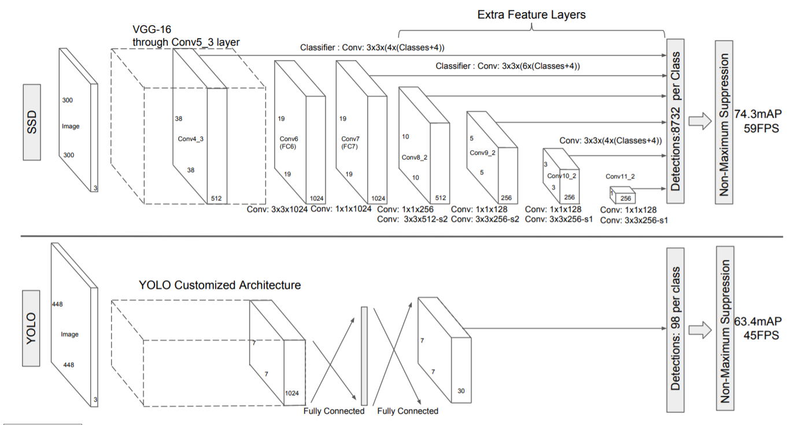

BoostCampAITECH
{:.note title="출처 및 참고"}

* this unordered seed list will be replaced by the toc
{:toc}

# SSD

## YOLO VS SSD

- **YOLO 단점**
    - 7x7 그리드 영역으로 나눠 Bounding Box prediction 진행 → **그리드보다 작은 크기의 물체 검출 불가능**
    - **신경망을 통과하며 마지막 feature만 사용 → 정확도 하락**

- **SSD 특징**
    - **Extra convolution layers에 나온 feature map들 모두 detection 수행**
        - 6개의 서로 다른 scale의 feature map 사용
        - 큰 feature map(early stage feature map)에서는 작은 물체 탐지
        - 작은 feature map(late stage feature map)에서는 큰 물체 탐지
    - **fully connected layer 대신 convolution layer 사용하여 속도 향상**
    - **Default box 사용**
        - 서로 다른 scale과 비율을 가진 미리 계산된 box 사용
- **Network**
    - **VGG-16(Backbone) + Extra Convolution Layers**
    - 입력 이미지 사이즈 300x300

## Multi-scale feature maps

- **채널의 개수 = box의 갯수 * (offset + box의 클래스)**
    - **offset** = cx, cy, w, h(4)
    - **N_C** = num classes(20) + background(1)
    - **N_bbox**
        - Different scale per feature maps (𝑆𝑚𝑖𝑛 = 0.2, 𝑆𝑚𝑎𝑥 = 0.9, 𝑚 = 6)
        
        
        
        - Differenct aspect ratio
            
            
            
        - Examples
            
            
            
- 6 default boxes per each cells(직사각형 5개, 정사각형 1개, 총 6개의 서로 다른 비율의 box를 만듦)
    
    
    

## Default Box

- **feature map의 각 cell마다 서로 다른 scale, 비율을 가진 미리 정해진 box 생성**
- Faster R-CNN의 anchr box와 유사함
    - 여러 scale의 feature map에 맞게 적용시킨 개념

## Multi-scale feature maps & Default Box

- ssd는 이와 같은 방식으로 8732개의 bounding box를 만듦

## Training

- **Hard negative mining**: 모델이 예측하기 어려운 sample을 추출(주로 FP)한 뒤, 학습 데이터에 포함시켜 FP에 강건하도록 학습
- **Non maximum suppression**
- **Loss**
    
    
    

## 장점과 단점

- **장점**
    - YOLO V1보다는 FPS 소폭 상승 mAP 크게 상승
    - end-to-end 학습, 저해상도 이미지에서는 높은 정확도
    - YOLO와 달리 FCN 미사용→FCN사용시 디테일한 정보가 사라지는 문제점 해소, 파라미터 개수 감소로 처리속도 빠름
- **단점**
    - 작은 크기는 여전히 못함
        - 작은 물체는 앞쪽 layer에서 생성된 feature map을 이용하여 object detection을 수행하므로 앞쪽은 depth가 깊지 않음
        - 그래서 저자는 Data Augmentation 사용

# RetinaNet

- **low level의 특징 layer들과 high level의 특징을 둘 다 활용하면서도 각 scale별로 물체를 잘 찾기위한 설계**
- **U-Net과는 달리 concat이 아닌 add**
- class, box head가 각각 구성돼서 classification과 box regression을 dense하게 각 위치마다 수행
- **SSD보다 빠르면서 성능이 좋음**

## Focal Loss

one stage detector는 **RoI Pooling이 없기 때문에 모든 영역에서의 loss가 계산**되고, 일정 gradient가 발생, 실제 필요한 것은 object에 대한 bbox인데 **배경도 만들어지므로 class imbalcne가 발생**

- **γ가 클수록 잘 맞추면 gradient가 0에 가까워 무시되고, 못 맞추면 sharp한 gradient가 발생해 큰 영향을 줌**
- 어렵고 잘못 판별된 예제들에 대해선 강한 weight를 주고, 쉬운 것들에 대해서는 작은 weight를 줌

# DETR

- **Transformer를 object detection에 적용**
- CNN의 feature map과 각 위치를 multi-dim으로 표현한 encoding을 섞어 입력 토큰으로 만듦
- **Encoding된 feature들을 decoder에 넣으면, query(각 위치)에 해당하는 물체가 뭔지, bbox에 대한 정보와 함께 파싱되어 나옴**

# Further reading

- 요즘엔 b-box regression을 하지 말고 **다른 형태의 데이터 구조**로 탐지가 가능한지 연구중이라고 함 → **CornerNet, CenterNet**

## CornerNet

기존에는 Bounding box는 top-left, bottom-right인데 backbone에서 나온 feature map의 **네가지 헤드를 통해 heatmap을 통한 각각의 점들을 detection하여 top-left, bottom-right corner를 검출**

embedding head를 통해 **각각의 poiont들을 표현함**

학습할 때 같은 object의 top-left, bottom-right corner에 대해 embedding이 서로 가깝게 되도록 학습하고 다른 object의 corner는 embedding이 멀어지도록 학습

## CenterNet

- CenterNet의 Bounding box = {Top-left, Bottom-right, **Center**} points를 추가해서 학습을 진행
- 또 다른 variant로 width, height, center만 있으면 최소한의 정보롤 detection이 가능한 방법