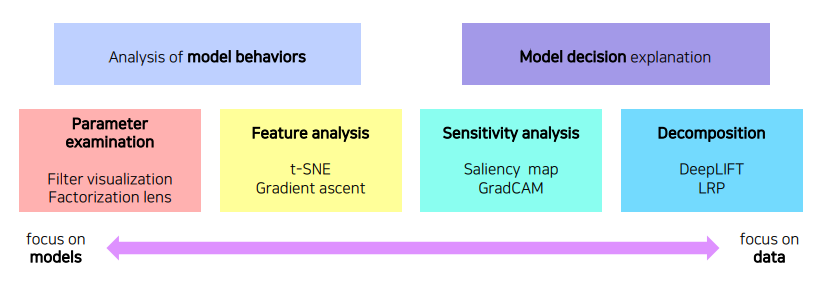

[GAP](https://gaussian37.github.io/dl-concept-global_average_pooling/)
BEYOND AI BASIC
{:.note title="출처 및 참고"}

* this unordered seed list will be replaced by the toc
{:toc}

# Visualization CNN

CNN이 패턴을 발견해 내는 과정을 시각화하여 확인하는 방법



1. 모델 자체의 특성을 분석하는 방법
2. 하나의 입력 데이터에서부터 모델이 왜 그런 결과를 냈는지 출력을 분석하는 방법

## ZFNet


눈으로 보면서 튜닝하는 ZFNet, low level에는 좀 더 방향성이 있는 선을 찾는 필터들처럼 기본적인 영상처리 필터같이 생긴 것들이 보이고 high level으로 갈 수록 점점 의미있는 표현을 학습

## Vanilla ex: filter visualization


AlexNet에서 다음과 같이 11x11x3 크기인 filter size를 첫 번째 convolutional layer에 사용한다면 각종 영상처리 필터로 학습된다는 것을 알 수 있는데 이를 activation visualization을 한다면 각 필터마다 한 채널로 나오기에 흑백으로 나오지만 각 필터의 특성마다 디테일한 결과를 볼 수 있음

**첫 layer의 경우 3개의 채널로 구성되어 viz를 할 수 있지만 뒤쪽은 차원수가 높아서 어려움**

# Analysis of model behaviors

## Embedding feature analysis

high level layer를 해석하는 방법

## 1. Nearest neighbors(NN)


Query 이미지와 유사한 이웃 영상들을 DB에서 찾아서 거리순으로 정렬

검색된 예제를 통해서 분석하는 방법은 전체적인 그림을 파악하기 어려운 단점이 존재


1. NN에서 마지막 fc layer를 제거해 input image의 feature vector를 추출할 수 있게 함
2. DB의 모든 이미지들을 feature vector를 추출해 다시 DB에 저장
3. Query image를 넣어 feature vector를 추출하고 그것과 근접한 거리에 있는 feature vector의 원본 image를 찾아 return

## 2. Dimensinality reduction


고차원 공간의 경우 해석의 어려움이 있기때문에 저차원 공간으로 축소함으로서 눈으로 확인하기 쉽게할 수 있음

### **t-distributed stochastic neighbor embedding(t-SNE)**

- high dim feature를 2차원 상에 클래스마다 다른 색으로 표현
- 튀는 ex 제외하고 비슷한 클래스끼리 잘 분포됨을 볼 수 있음


### **layer activation**

mid level과 high level을 해석하는 것으로 layer의 activation을 분석함으로서 model의 특성을 파악하는 방법


AlexNet에서 Conv5 layer의 138-channel의 activation을 적당한 값으로 thresoulding 후 마스크로 만들어서 영상에 overlay한 결과, 각 activation의 채널이 어디를 중점으로 바라보는지 파악 가능, **CNN은 중간의 hidden node 들이 손, 얼굴 등 부분을 detect하는 것을 다층으로 쌓아서 물체를 인식하는 것을 알 수 있음**

### **Maximally activating patches**


mid layer에 적합하고 patch를 뜯어서 사용하는 방법, 각 레이어의 채널에서 하는 역할을 판단하기 위해 hidden node에서 가장 큰 값을 가져온다고 했을 때 다음과 같은 것을 얻음

1. Pick a channel in a certain layer
2. Feed a chunk of images and record each acrivation map(of the chosen channel)
3. Crop image patches around maximum activation values

### **class visualization**

각 클래스를 판단할 때 network는 어떤 모습을 상상하고 있을까를 확인할 수 있는데, 해당 class의 object만 판단하는 것이 아닌 그 주위 것들도 같이 찾는다를 알 수 있음


이런 영상은 어떻게 추출하는지 알아보면 gradient descent와 같은 최적화를 하게 되는데 이와 반대인 **gradient ascent를 사용**


두 가지 loss를 합성해서 사용함

- 어떤 입력이 주어졌을 때 **어떤 CNN model f()를 거쳐 출력된 하나의 class score를 maximize하는 것**
- 영상이 아닌 객체들도 찾게될 때 우**리가 알고 있거나 이해할 수 있는 영상으로 유도하기 위해서 추가됨**
- L2 norm의 합이 작아지는 방향으로 람다 값을 사용하여 컨트롤

1. Get a prediction score(of the target class) of a dummy image(black or random initial)
2. Backpropagte the **gradient maximizing** the target class w.r.t. the input image
3. Update the current image(반복)

# Model decision explanation

모델이 특정 입력을 어떤 각도로 해석하고 있는집 분석하는 방법

## Sailency test

영상이 주어졌을 때 제대로 판정되기 위한 각 영역의 중요도를 추천하는 방법

### Occlusion map

- 특정 영역을 occlusion 했을 때 전체 image를 정확한 class로 판별할 확률을 heatmap으로 만듦
- 진한 색일수록 class 검출에 중요한 영역이라는 것을 파악할 수 있음

### v**ia Backpropagation**

Backpropagation을 사용하여 특정 이미지를 classification을 해보고 최종 결론이 나온 class에 결정적으로 영향이 미친 곳이 어디인지를 heatmap으로 나타낸 방법

1. get a class score of the target source image
2. Backpropagate the gradient of the class score w.r.t. input domain
3. Viz the obtained gradient magnitude map(optionally, can the accumulated)

## Backpropagte features

### Rectified unit(backward pass)


**일반적으로 CNN에서 ReLU를 이용하면 forward에서 음수인 부분은 0으로 masking**, backprop할 때 양수와 음수가 합쳐진 gradient가 오면 음수 마스크로 저장된 패턴 마스크로 마스킹해줌

**Zeiler는 deconvolution을 사용하여 backward pass때도 음수에 해당하는 부분을 마스킹하는 방법 사용(즉, backward에도 ReLU 함수를 사용)**


**아래와 같이 두 가지 방법을 and gate하는 방법(forward, backward 모두 ReLU)**


결과는 두 가지 방법을 and gate한 것이 좀 더 클린한 결과를 얻음


# Class activation mapping

## CAM

가장 유명하고 자주 사용되는 알고리즘, **viz which part of image contributes to the final decision**


**neural network 일부를 조금 개조, convolution의 마지막 feature map을 gap(global average pooling)을 적용시키고 그 다음 fc layer를 하나만 통과시켜 최종적으로 classification하게 함**


하나의 클래스 c에 대한 score는 마지막 fc layer의 weight들과 gap feature, 각 공간축의 평균을 내서 하나의 노드로 만든 그런 layer의 feature들의 linear combination으로 스코어가 만들어짐


위치 정보가 주어지지 않아도 위치를 파악하는 장점, **CAM 적용이 가능한 제약으로는 마지막 레이어의 구성이 gap, fc layer로 구성되어야 함**


일부 모델에서는 CAM을 사용하기 위해 아키텍쳐를 바꾼 후 재학습 → 성능 떨어짐, 파라미터 튜닝 다시해야함, GoogLeNet은 average pool, fc가 있어서 적용 쉬움

### GAP(Global Avearge Pooling)


max(average) pooling보다 급격하게 feature의 수를 줄임 하지만 GAP의 목적은 조금 다르게 **feature를 1차원 벡터로 만들기 위함**

- 같은 채널의 feature들을 평균내고 채널의 개수만큼 원소를 가지는 벡터를 만듦 →(h, w, c)의 형태를 (c,)로 간단하게 만듦

**GAP은 CNN+FC에서 classifier인 FC Layer를 없애기 위한 방법으로 도입**

- FC는 마지막 feature와 matrix 곱을 하여 feature 전체를 연산의 대상으로 삼아 결과를 출력(즉, feature가 이미지 전체를 함축하고 있다고 가정하면 이미지 전체를 보고 출력을 만듦) → FC layer를 clssifier로 사용할 때 파라미터의 수가 많이 증가, 이미지 사이즈 고정의 단점
- GAP은 어떤 크기의 feature라도 같은 채널의 값들을 하나의 평균으로 대체하기 때문에 **어떤 사이즈의 입력이어도 상관없음**

GAP 연산 결과 1차원 벡터가 되기 때문에 **최종 출력에 FC Layer 대신 사용**

```python
import torch
import torch.nn.functional as F

x = torch.randn((256, 96, 128, 128)).cuda()

F.avg_pool2d(x, x.size()[2:])
F.adaptive_avg_pool2d(x, (1, 1))
torch.mean(x.view(x.size(0), x.size(1), -1), dim=2)
```

## Grad-CAM


**구조 변경 없이 CAM을 사용할 수 있음**

- Pre-trained network를 변경하지 않고 사용할 수 있음
- Model을 변경할 필요가 없기 때문에 image task에만 국한되지 않고 **backbone이 CNN이기만 하면 사용 가능**


**input image까지가 아닌 activateion map(conv layer)까지만 backprop**

**task에서 해석하고 싶은 결과 y(class score), y를 변화시키는 loss 로부터 gradient를 구하게 되고 gap을 하여 공간축으로 average pooling을 적용** → 각 channel의 gradient 성분을 구하게 됨


그리고 이것을 **선형결합을 통해서 결합**을 해주는데 이전과는 다르게 **ReLU를 사용하여 양수 값만 사용**


CNN backbone 외엔 별다른 요구사항이 없어서 여러 테스크에 사용, rough, smooth, class에 민감하고 Guided Backprop은 sharp, sensitive, high frequency하기에 둘의 결과를 곱해서 특정 클래스에 대한 texture만 알아낼 수 있음

## SCOURTER


Grad-CAM을 개선해서 class를 판별할 뿐만 아니라 어딜 보고 해석했는지, 왜 다른 class는 아닌지에 대한 정보도 얻을 수 있음

# Conclusion: GAN dissection


**Hidden node가 어느 부분을 담당하는지 알면 GAN 같은 생성모델에도 이용 가능**, 해석 방법을 알면 이를 응용할 수도 있어야 함