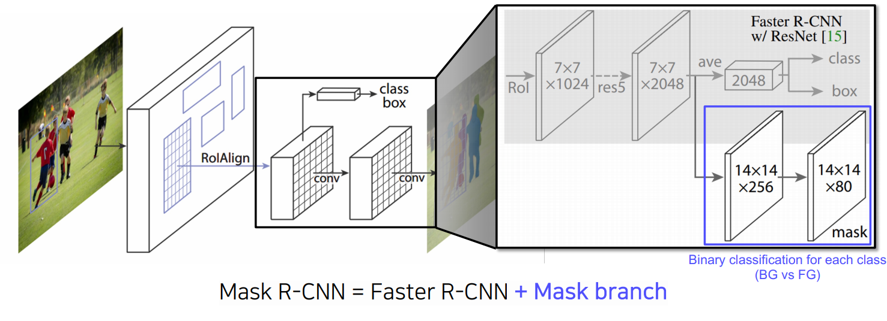

BEYOND AI BASIC
{:.note title="출처 및 참고"}

* this unordered seed list will be replaced by the toc
{:toc}

# Instance Segmentation
semantic과 달리 **instance가 다르면 구분해줌**

## Mask R-CNN

Fast RCNN에서는 RPN에 의해서 나온 bounding box에 RoI Pooling을 사용하였고 정수 좌표만 지원하였음

Mask R-CNN은 **RoI Align이라는 새로운 Pooling layer를 제안하였고 interpolation을 통해서 픽셀 level의 pooling을 지원하게 됨**

Fast R-CNN에서는 pooling된 feature 위에 올라갔던 classification, box regression이 있었음

Mask R-CNN에서는 **Mask Branch**가 있는데, 7x7에서 14x14로 upsampling을 하고, 채널을 2048에서 256으로 줄임

그 다음 **각 클래스별로 binary mask를 prediction하는 구조** → 모든 클래스에 대해 mask를 생성하고 classification head에서 class 정보가 모일 것이라는 예측 결과를 이용하여 어떤 mask를 참조할 것인지 선택

## Summary of the R-CNN family

## YOLACT(You Only Look At CoefficientTs)

Real-time으로 segmentation이 가능한 single stage network

- 기본 backbone: feature backbone pryamid 구조를 가져와서 사용하기 때문에 고해상도의 feature map을 가지고 사용을 할 수 있음
- 가장 큰 특징으로 **mask의 prototype**을 추출해서 사용
    - 실제 mask rcnn에서 실제로 사용하지 않더라도 80개의 class를 고려하고 있다고 한다면 80개의 각각 독립적인 mask를 한번에 생성
    - 그 중 classification된 결과에 따라 하나를 참조하는 형태
    - **prototype**이라고 해서 mask는 아니지만 **mask를 합성해내는 기본적인 여러 물채의 soft segmentation componet들을 생성**(mask는 아니지만 mask로 합성할 수 있는 재료를 제공)
- prediction head에서각  detection에 대해 prototype들을 잘 합성하기 위한 **mask coefficient**들을 출력해주고 이 계수와 prototype을 **선형 결합**하여 각 detection에 적합한 **mask response map 생성**
- key point: prototype의 수를 object의 수와 상관없이 작게 설정하여 선형 결합을 통해 다양한 mask 생성(같은 수라면 더 많은 비용 발생)

## YolactEdge

이전 keyframe에 해당하는 feature를 다음 frame에 전달해서 feature map의 계산량을 획기적으로 줄임, 성능은 기존 방법을 유지

# Panoptic Segmentation

기존의 instance segmentation은 배경에 관심이 없었고 움직이는 작은 물체에만 관심

배경 등에 관심이 있을 때는 semantic segmentation이 유리했지만 instance를 구별하지 못해서 둘을 합친 **panoptic segmetnation(배경+instance)**

## UPSNet

- **backbone**: fpn을 사용하여 고해상도의 feature map을 뽑고 head branch를 여러개로 나눔
    - **semantic head**: fc 구조로 되어 semantic map을 prediction하게 됨
    - **instance haed**: class의 detection과 box regression, mask 추출
- **Panoptic head**: 최종적으로 하나의 segmentation map

- 각 head에서 나온 결과
    - instance에 해당하는 mask
    - 각 물체들과 배경을 예측하는 mask
    - 배경을 예측하는 mask는 최종 출력으로 바로 들어감

각 instance들을 bounding box가 아닌 전체 영상에 해당하는 위치에 다시 넣으면서 보강하기 위해 **semantic head의 물체 부분을 masking해서 그 response를 instance response와 더해주어 최종 출력에 삽입** (Y_i에서 box의 크기가 물체의 크기와 일치한다고 하면 전체 영역에서 어디에 위치했는지 조정해서 넣음)

물체와 배경에 소속되지 않는 unknown class를 고려하기 위해서 **semantic mask map의 instance로 사용된 부분을 제외해서 나머지 베타적인 부분도 모두 unknown class로 합쳐 하나의 층으로 추가**

## VSPNet

> 모션 맵: 두 개의 영상이 있으면 한 영상에서 다음 영상으로 어떤 포인트가 어디로 가는지 대응점들을 모든 픽셀에 대해서 가지고 있는 것

**두 시간차를 가지는 두 영상 사이의 phi라는 모션 맵을 사용해서 각 frame에서 나온 feature map을 모션에 따라서 warping**

1. Align refrence feature onto the target feature map(Fusion at pixel level)
2. Track module associates differenct object instance(Track at instance level)
3. Fused-and-tracked modules are trained to synergize each other

- t-𝜏에서 뽑힌 feature를 마치 현재 target frame인 t에서 찍은 것과 마찬가지로 feature를 하나씩 옮겨줌
- t에서 찍힌 feature와 warping된 feature를 합침

이런 방식으로 현재 frame에서 추출된 feature만으로도 대응하지 못하거나 보이지 않게 가려져 있던 부분도 이전 frame에서 빌려온 특징 덕분에 더욱 높은 detection 성공률을 얻음

여러 frame의 feature를 합쳐서 사용하여 시간 연속적으로 smooth한 segmentation이 될 확률도 높아짐

FPN을 통해 RoI feature를 추출해서 기존 RoI들과 tracking head를 통해 현재 RoI들이 어떻게 연관되어 있는지, 그 이전의 몇 번의 id를 가졌던 물체였는지 연관성을 만들어줌(새로 추출된 RoI가 기존 추출된 RoI와 match하여 tracking)

나머지는 UPSNet과 같이 Bbox head, Mask head, Semantic head가 있으며 각 head에서 나온 결과는 하나의 panoptic map으로 합쳐줌

# Landmark Localization

주로 얼굴이나 사람의 포즈를 추정하고 트래킹하는데 사용하는데 얼굴이나 사람의 몸통 등 측정 물체에 대해서 중요하다고 생각하는 특징 부분(keypoint=landmark)를 정의하고 추정 및 추적하는 것임, landmark는 이미 정의해놓은 것

## Coordinate regression VS heatmap Classification

key point를 찾기 위한 방법으로 coordinate regression의 경우 box regression처럼 각 포인트의 x, y 위치를 regression하는데, 부정확하고 일반화 문제가 있음

**heatmap classification 방법**은 마치 semantic segmentation처럼 채널들이 하나의 keypoint를 갖게되고 각 keypoint들마다 하나의 class로 생각하여 그 keypoint가 발생할 확률 맵을 각 픽셀별로 classification하는 방법으로 대신 해결하는 것이 제시됨 → 성능은 좋지만 높은 계산량

### Landmark location to Gaussian heatmap

**heatmap 표현은 각 위치마다 confidence가 나오는 형태의 표현**으로 x, y가 label로 주어졌을 때 heatmap으로 변환

- location으로부터 heatmap으로 어떻게 변환할까?
    - (x, y)는 heatmap 전체 크기 내에서 가능한 pixel들
    - (x, y)가 landmark point (x_c, y_c)일 때 gaussian 값이 가장 크고, 멀어질 수록 작아짐
- 반대로 heatmap을 location으로 변환?
    - gaussian 값이 가장 큰 곳은 landmark point이기에 heatmap의 activation value가 가장 큰 곳의 (x, y)를 구하면 됨

## Hourglass network

landmark detection에 맞춘 network, unet 구조와 비슷하며, unet의 구조가 모래시계처럼 생겨 Stacked Hourglass라고 부름

1. 영상을 전반적으로 작게 만들고 receptive field를 크게하여 landmak를 찾기 위해
2. receptive filed를 크게 가져서 큰 영역을 보면서도 skip connecton이 있어 low level feature를 참고하여 정확한 위치를 특정하기 위해

hourglass network와 unet은 비슷한 구조지만 다른 점은 **skip할 때 또 다른 convolution layer를 거치고 concat이 아닌 add임(dim이 늘어나지 않음)**

## DensePose

> **UV map**: 3d model의 각 부위를 2d로 펼쳐서 이미지 형태로 만들어 놓는 좌표 표기법

UV map에서 한 점은 3D Mesh의 한 점과 1:1 매치가 됨, 3D mesh는 triangle로 이뤄져있는데 해당 triangle에 있는 점을 matching이 되고 각 triangle이나 점들에 고유 id를 갖기에 3D Mesh가 움직여도 tracking이 되면서도 보존됨, UV map의 좌표를 바로 출력하는 DensePose는 3D Mesh를 바로 출력하는 것과 같음

**texture**: 이미지로 저장하는 것이 편하므로 UV map이라는 표현이 그래픽스에서 3D Model에 texture를 입히기 위해 고안됨 → 좌표 특성을 DensePose에 응용

**Mask R-CNN과 비슷하고 Faster R-CNN과 3D surface regression branch를 도입한 확장형 모델**

Patch: 각 바디 피트의 segmenataion map이며 이와 같은 구조는 동일하더라도 입력 데이터와 출력 데이터의 관계를 잘 설계함으로써 2D 구조의 CNN으로 3D를 잘 예측하도록 설계

## RetinaFace

**classficiation, box regression, 기본적인 landmak를 regrssion, 3d face mesh로 출력하는 다양한 task를 한 번에 풀도록 만듦** → multi task

**multi task**로 하면 장점이 각 task마다 공통적으로 얼굴에 대해 조금씩 다른 것을 앎

**이를 통해 backbone network가 강하게 학습** → **gradient가 여러 곳에서 오면 공통적인 정보도 있고 조금 다른 정보도 있어서 한 번에 업데이트될 때 모든 상황에 맞게 학습**(데이터를 많이 본 것과 같은 효과를 내고 적은 데이터로도 강인한 학습 효과)