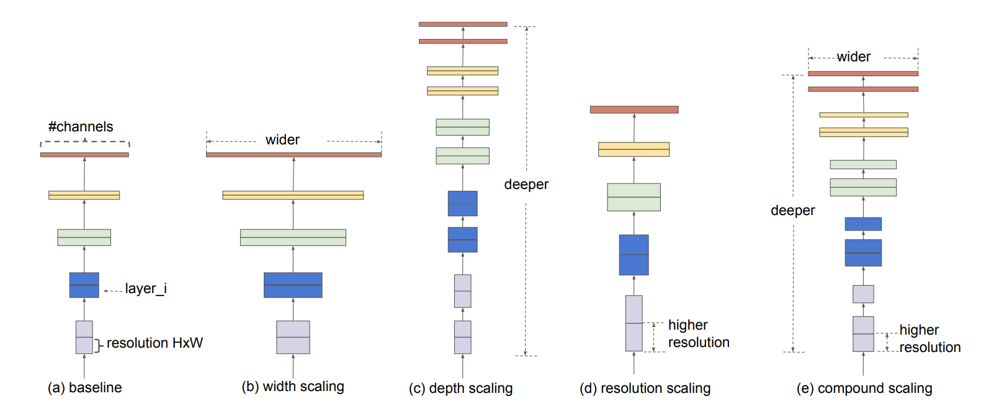

[WRN](https://deep-learning-study.tistory.com/519)
[EfficientNet and EfficientDet](https://eehoeskrap.tistory.com/404)
BoostCampAITECH
{:.note title="출처 및 참고"}

* this unordered seed list will be replaced by the toc
{:toc}

1. EfficientNet : Improbing Accuracy and Efficiency through AutoML and Model Scaling
2. EfficientDet：Scalable and Efficient Object Detection 

# Efficient in Object Detection

## Model Scaling

1. **baseline network**
    - 기본적인 신경망 구조
2. **width scaling**
    - filter(=channel)의 수를 늘려서 scale-up하는 방법
    - width를 제어하는 모델은 대게 작은 크기의 모델이며, 기존 연구에 따르면 width를 넓게 할 수록 미세 정보들을 더 많이 담을 수 있다고 함
    - WRN(Wide Residual Network)
        
        
        
        - residual network의 넓이를 증가시키고 깊이를 감소시킨 모델
3. **depth scaling**
    - layer의 수를 늘려서 scale-up하는 방법
    - 가장 흔한 sclae 방식, 깊은 신경망은 더 좋은 성능을 달성할 수 있지만 신경망을 계속 깊게 쌓는 것은 한계, 실제로 ResNet-1000과 ResNet-101은 거의 비슷한 성능을 가짐
4. **resolution scaling**
    - input image의 해상도를 높여서 scale-up하는 방법
    - 최신 연구인 GPipe에서는 480x480, object detection 영역에서는 600x600을 사용하면 더 좋은 성능을 보임
5. **compound scaling**
    - **efficientNet에서 제안한 방법**
    - **width+depth+resoultion을 적당히 조절하여 정확도를 높이고자 함**

**FLOPS는 매우 작지만 mAP는 아주 좋음**

# EfficientNet

## 등장 배경

- 파라미터 수가 점점 많아지고 있는 모델, ConvNet은 점점 커짐에 따라 점점 더 정확해짐
- 점점 빠르고 작은 모델에 대한 요구가 증가하였고 효율성과 정확도의 trade-off를 통해서 모델 사이즈를 줄이는 것이 일반적이었음
- **하지만, 큰 모델에 대해서는 어떻게 모델을 압축시킬지가 불분명했기에 아주 큰 SOTA ConvNet의 efficiency를 확보하는 것이 목표→ 모델 스케일링**

## Scale up

### Width Scaling

네트워크의 width를 스케일링하는 방법은 MobileNet이나 MnasNet과 같은 작은 모델에서 주로 사용이 되었음

더 wide한 네트워크는 미세한 특징을 잘 잡아내는 경향이 있으면서 학습도 쉬웠지만 극단적으로 넓지만 얕은 모델은 high-level 특징들을 잘 잡아내지 못하는 경향이 있었음

### Depth Scaling

네트워크의 깊이를 스케일링하는 방법은 많은 ConvNet에서 사용이 됨(DenseNet, inception-v4)

깊은 ConvNet은 더 풍부하고 복잡한 특징을 잡아낼 수 있고, 새로운 테스크에도 잘 일반화되었지만 깊은 네트워크는 gradient vanishing 문제가 있기에 학습이 어려움

### Resoultion Scaling

고화질의 input 이미지를 잘 이용하면 ConvNet은 미세한 패턴을 잘 잡아낼 수 있고, 최근 Gpipe는 480x480 이미지를 이용하여 SOTA 달성

## Accuracy & Efficiency

**object function 정의**

**N: 모델 → 모델의 accuracy를 최대로 하는 depth, width(channel), resoultion을 찾고, 조건은 모델의 memory와 flops는 target보다 작아야 함**

**object function의 scale factor(d,w,r)를 바꿔가면서 실험한 결과**

1. 네트워크의 폭, 깊이, 혹은 해상도를 키우면 정확도 향상되지만 더 큰 모델에 대해서는 정확도 향상 정도가 감소
2. 더 나은 정확도와 효율성을 위해서는 ConvNet 스케일링 과정에서 네트워크의 폭, 깊이, 해상도의 균형을 잘 맞춰주는 것이 중요

### Compound Scaling Method

실험 결과에 따라 다음 조건을 만족하는 compound scaling 방법을 제안

> *α*,*β*,*γ :* d,w,r을 얼마나 바꿀건지 조절하는 param (이들은 s.t.와 같은 제약조건을 가짐. r은 가로세로 동시에 늘어나므로 제약조건에 square 텀이 붙음)

> *ϕ* : 만약 제약조건을 만족하는 *α*,*β*,*γ*가 fix가 되면 *ϕ*를 늘려나가면서 d,w,r방향으로 scale up하는 param

## EfficientNet-B0

- MnasNet에 영감을 받음
- 최적화하기 위함
    
    
    
- Accuracy와 FLOPs를 모두 고려한 뉴럴넷
- Nas 결과, EfficientNet-B0

**Step1**

- ∅ = 1 로 고정
- 𝛼, 𝛽, 𝛾를 small grid search를 통해 찾음
- 𝛼 = 1.2, β = 1.1, 𝛾 = 1.15 under constraint of α ∙ 𝛽^2∙ 𝛾^2 ≈ 2

**Step2**

- 𝛼, 𝛽, 𝛾를 상수로 고정
- 다른 ∅를 사용해 scale up
- EfficientNet-B1 ~ B7

## Results

# EfficientDet

## 등장 배경

모델이 실생활에 사용되기 위해서는 모델의 사이즈와 대기 시간에 제약이 있기에 사이즈와 연산량을 고려하여 활용 여부가 결정되었고 이런 제약으로 **Object Detection에서 Efficiency가 중요해짐**

그동안 1 stage model(yolo, sdd, retinanet), anchor free model들이 있었지만 정확도가 낮았음

**→ 자원의 제약이 있는 상태에서 더 높은 정확도와 효율성을 가진 detection 구조를 만드는 것이 가능할까?**

**→ EffDet: backbone, FPN, and box/class prediciton networks at the same time!**

## Challenge

1. Efficient multi-scale feature fusion: In Neck, Simple Summation
2. Previous work focus on large backbone & image size

### 1. Efficient multi-scale feature fusion

EfficientDet 이전에는 multi-scale feature fusion을 위해서 FPN, PANet, NAS-FPN 등 Neck을 사용했지만 **대부분의 기존 연구는 resoultion 구분 없이 feature map을 단순 합했음**

서로 다른 정보를 가졌는데 단순합?

- 각각의 input을 위한 학습 가능한 weight를 두는 **weighted feature fusion 방법으로 BiFPN를 제안**
    
    
    
    - 하나의 간선을 가진 노드 제거
    - Output 노드에 input 노드 간선 추가
    - 양방향 path 각각을 하나의 feature layer로 취급하여, repeated blocks로 활용
- **모델의 Efficiency를 향상시키기 위해 croos-scale connections 방법**

EfficientDet은 여러 resoultion의 feature map을 가중합, FPN의 경우 feature map의 resoultion 차이를 Resize를 통해 조정한 후에 합

**BiFPN의 경우 모든 가중치의 합으로 가중치를 나눠주고 가중치들은 ReLU를 통과한 값으로 항상 0 이상, 분모가 0이 되지 않도록 아주 작은 값 𝜖을 더해줌 → fast normlizaed feature fusion**

- **weighted feature fusion**
    - **unbounded feature fusion**: unbound 되어 있어서 학습에 불안정성을 유발할 수 있기에 weight normlization을 사용
        
        
        
    - **softmax-based feature fusion**: softmax를 사용한 것인데, GPU 하드웨어에서 slowdown을 유발
        
        
        
    - **fast normalizaed feater fusion: weight들은 ReLU를 거치기에 non-zero 보장, 분모가 0이 되는 것을 막기 위해 0.0001 크기의 𝜖을 넣어주며, weight 값이 0~1 사이로 normlize가 되는 것인 Softmax와 유사하며 ablation study를 통해 softmax-based fusion 방식보다 더 좋은 성능을 보임**

 

### 2. Model Scaling

더 좋은 성능을 위해서 더 큰 backbone 모델을 사용해서 detector의 크기를 키우는 것이 일반적인데, EfficientDet은 accuracy와 efficiency를 모두 잡기 위해서 여러 constraint를 만족시키는 모델을 찾고자 하였고 **compound scaling 방식을 제안**

- **backbone: EfficientNetB0 ~ B6**
- **BiFPN network**
    - 네트워크의 width(= # channels)와 depth(= #layers)를 compound 계수에 따라 증가시킴
    - 1.35: grid search로 찾은 값, D: 기본적으로 3번 반복, *ϕ*만큼 더 반복
        
        
        
- **Box/class prediction network**
    - width는 고정, depth를 다음과 같은 식에 따라 증가
        
        
        
- **Input image resoultion**
    - Resoultion을 다음과 같이 선형적으로 증가
    - 기본 image scale은 512, *ϕ*에 128을 곱해주어 선형적으로 증가시킴
        
        
        

## Results

같은 연산 대비 성능 좋음

