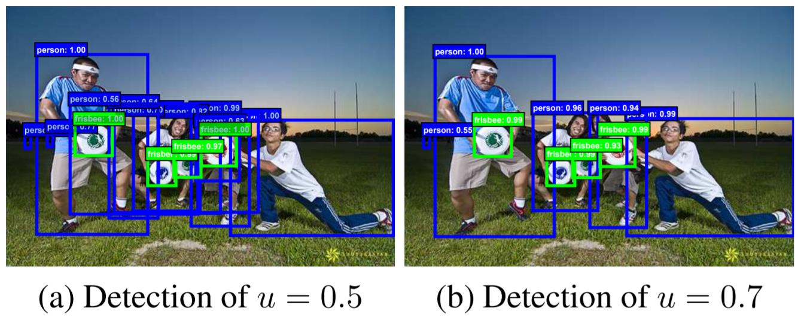

[DCN 리뷰](https://deep-learning-study.tistory.com/575)
BoostCampAITECH
{:.note title="출처 및 참고"}

* this unordered seed list will be replaced by the toc
{:toc}

# Cascade RCNN

faster rcnn에서 **positive/negative sample을 나누는 기준(0.5)에 집중**, **이 기준을 바꾸면** 어떻게 될까라는 생각에서 **cascade r-cnn이 제시됨**

## Motivation

- IoU threshold에 따라 다르게 학습되었을 때 결과가 다름
- Input IoU가 높을수록 높은 IoU threshold에서 학습된 model이 더 좋은 결과를 냄
- 전반적인 AP의 경우 IoU threshold 0.5로 학습된 모델이 성능이 가장 좋음
- 그러나 AP의 IoU threshold가 높아질 수록 IoU threshold가 0.6, 0.7로 학습된 모델의 성능이 좋음

**학습되는 IoU에 따라 대응 가능한 IoU box가 다름, 그래프와 같이 high quality detection을 수행하기 위해서는 IoU threshold를 높여 학습할 필요가 있음(단, 성능이 하락하는 문제 존재)**

→ **Cascade RCNN 제안**

## Method

- **(b) Iterative BBox at inference**
    - **bbox pooling을 반복 수행할 시 성능 향상되는 것을 증명**
- **(c) Integral Loss**
    
    
    
    - Faster RCNN과 다르게 IoU threshold가 다른 Classifier C1, C2, C3 학습
    - Loss의 경우 각각 C1, C2, C3의 classifier loss를 합함
    - inference시, C1, C2, C3의 confidence를 평균 냄
    - 큰 성능 향상 없음
    - **IoU threshold가 다른 Classifier가 반복될 때 성능 향상되는 것을 증명**
- **(d) Cascade R-CNN**
    - 여러 개의 RoI head(H1, H2, H3)를 학습
    - 이 때 Head 별로 IoU threshold를 다르게 학습
    - C3, B3이 최종 결과
    - **IoU threshold가 다른 RoI head를 cascade로 쌓을 시 성능 향상되는 것을 증명**

# Deformable Convolutional Networks(DCN)

## CNN 문제점

일정한 패턴을 지닌 CNN은 geometric transformations(affine(이미지 변형), view point(다른 관점에서 보는 것), pose)에 한계를 지녔음

기존의 해결하는 방법으로는 geometric augmentation, geometric invariant feature engineering이 있지만 **기존의 사람이 넣어준 연산들만 학습할 수 있었고 해결하기 위해서 Deformable convolution가 등장**

## Deformable convolution

- a: 기존의 convolution에서 값을 추출하는 영역
- b,c,d: deformable convolution으로 값을 추출하는 영역

**이전에는 고정된 영역에서 특징을 추출했지만 irregular convolution을 사용하는 학습법으로 좀 더 flexible한 영역에서 특징을 추출**(feature map에서 좀 더 광범위한 grid cell의 값을 샘플링)

- **deformable convolution을 나타낸 그림**
    - input feature map에서 2 branch로 나눠짐
        - conv→offset filed→offsets와 같이 offset을 계산하는 branch
        - offset 정보를 받아 conv 연산을 수행해 output feature map을 계산하는 branch

**일정한 패턴이 아닌 offset을 학습시켜서 위치를 유동적으로 변화하고 주로 object detection, segmentation에서 좋은 효과를 보임**

**convolution**

p는 location을 의미, **기존의 conv 연산을 보면 피쳐맵에서 정해진 grid만 특징을 추출**(3x3 filter를 사용시 3x3 영역에서만 특징을 추출)하고 weight와 곱해져서 덧셈 연산이 작용

weight가 R을 참고하면서 Input feature map의 어떤 픽셀과 곱할지 결정

**Deformable convolution**

배경에서 conv를 학습하지 않고 객체에서만 학습시켜서 객체에서만 학습시켜서, 객체가 있을법한 위치 더 잘 학습

**offset(** **∆𝑃𝑛 )을 추가하여 좀 더 넓은 범위의 grid 영역에서 특징을 추출**, 또한 이 offset은 학습이 가능하고 작은 값이라 소수점이 될 수도 있음, 소수점 위치의 값을 bilinear 연산을 통해서 계산

한 점 𝑃0 에 대한 convolution 과 deformable convolution layer, **∆𝑃𝑛 만큼 더해줌으로써 deformable 하게 만들어줌**

xy 평면상의 bilinear 연산이므로 2N의 채널이 필요하고, offset을 계산하는 filter는 오차 역전파법에 학습이 가능

conv layer로 offset을 계산하고 이 offset 정보를 추가하여 conv 연산을 수행

deformable convolution을 적용시 object scale에 따라 receptive filed가 다른 것을 확인할 수 있고 기존에는 object scale과 관계없이 고정된 영역에서만 특징을 추출함

큰 객체일 수록 receptive 영역이 넓고, 배경 이미지의 경우 receptive file가 광범위하고, 자동차에는 좁은 범위의 receptive filed가 형성, offset이 학습 가능한 변수이기에 loss를 최소화하기 위한 방향으로 학습함

## Deformable RoI Pooling

**RoI Pooling에도 Deformable 방법을 적용**

RoI Pooling은 RoI를 일정한 그리드로 나눠서 해당 그리드에 속하는 값을 평균하거나 최댓값을 취하여 고정된 크기의 feature map을 생성, 생성된 RoI 범위 내에서 grid를 분할하는 것이 아닌 생성된 RoI 범위보다 넓은 범위의 값을 이용하여 RoI Pooling을 수행

deformable conv와 다른 점은 offset을 fc layer로 계산

**RoI Pooling으로 feature map을 생성 → fc layer를 거쳐서 offset 생성 → offset 활용하여 deformable RoI Poolling을 수행하여 최종 feature map 생성**

deformable RoI pooling을 사용시 좀 더 중요한 정보를 가진 RoI를 이용한다는 것을 알 수 있음

## Performance

1. 객체의 크기와 receptive filed의 상관관계
2. 배경이나 큰 물체의 경우 넓은 범위의 receptive filed가 필요