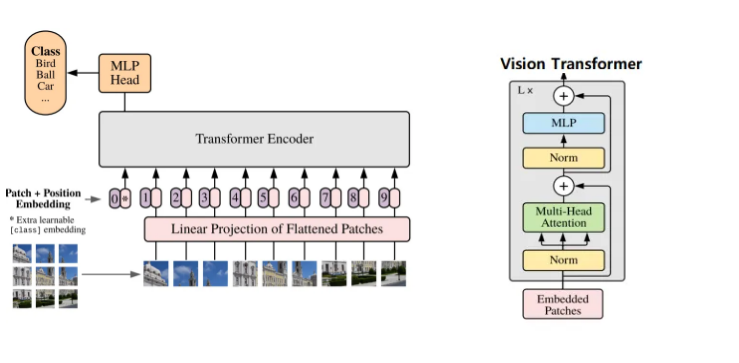
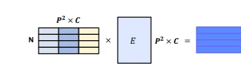
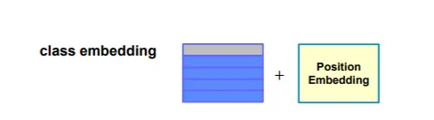
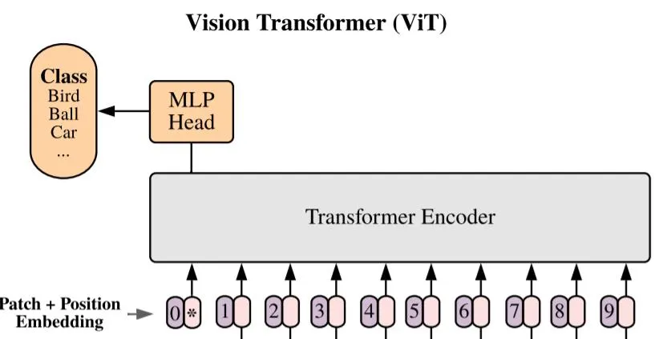

[Vision Transformer(1)](https://hongl.tistory.com/232)
[논문리뷰: An Image is Worth 16X16 Words: Transformers for Image Recognition at Scale](https://jeonsworld.github.io/vision/vit/)
BoostCampAITECH
{:.note title="출처 및 참고"}

* this unordered seed list will be replaced by the toc
{:toc}

# Vision Transformer(ViT)

## 1. Flatten 3D to 2D, Learnable한 embedding 처리

- **패치 크기가 P일 때, 하나의 이미지 $$x\in{R^{H*W*C}}$$는 각 패치가 flatten되어 구성된 $$x_p\in{R^{N*(P^2\cdot{c})}}$$시퀀스가 됨(N은 패치의 개수)**

- 이미지 크기가 H=W=16, P=8, C=3일 때
    
    $$
    N = \frac{HW}{P^2}=\frac{16*16}{8*8} = 4
    $$
    
    - 패치의 개수(N) 4개의 8x8x3=192 차원의 텐서로 이뤄진 시퀀스가 됨
- 이후 시퀀스의 각 요소 별로 임베딩을 위한 linear Projection(아래식)을 사용하여 D차원에 매핑
    
    
    
    - Transformer 모델과 마찬가지로 모델 전체의 차원은 D로 통일
    - E: learned embedding matrix를 의미
    - 이 linear projection의 output을 patch embeddings
- 즉, H=W=16, P=8인 경우에 patch embedding 결과 4x192=768 크기의 패치 임베딩 행렬이 도출됨

## 2. Add position embedding, class embedding

### class embedding을 추가([CLS]Token)

- **BERT의 class token과 마찬가지로 입력 시퀀스 맨 앞에 학습 가능한 임베딩 파라미터를 붙임($$z^0_0=x_{class}$$)**
    - class token은 이것의 인코더 출력이 ($$z^0_L$$) 전체 이미지의 representation을 나타내는 특별한 token으로 최종단의 classification을 위한 MLP layer가 $$z^0_L$$에 달리게 됨
    - 대용량 데이터 셋을 이용한 사전 훈련시에는 $$z^0_L$$에 2-layer MLP가 달리고 fine-tuning시에는 1-layer가 달리게 됨
- 결과적으로 class token을 위한 embedding은 1x192 크기의 텐서가 되고 왼쪽에 붙어서 최종 텐서의 크기가 (4+1)x192가 됨
    - **$$R^{(N+1)}*D$$에서 +1인 이유**
        
        
        
        - embeding patche 시퀀스 맨 앞에 [CLS] token($$x_{class}=z^0_0$$)을 concat함

### position embedding 추가

- **시퀀스 각 요소의 위치 정보를 알려주기 위해서 더해줌**
    
    
    
    - 5x192 크기의 텐서로 1차원 position embedding

## 3. Transformer

ViT에서의 Transformer encoder는 기존 Transformer 대비 순서가 약간 변형된 순서로 진행됨

**Multi-headed self-attention(MSA) 및  MLP block으로 구성**

**LayerNorm(LN)은 모든 block 이전에 적용되고 residual connection은 모든 block 이후에 적용**

## Multihead self attetnion

Multihead self-attention과 관련되서는 기존 Transformer와 거의 비슷하게 동작

입력 시퀀스 $$z\in{R^{N*D}}$$라면 각 헤드별 self attention은 아래와 같이 동작, $$D_h$$는 헤드별 feature 차원으로 전체 $$D$$에서 헤드 개수를 나눠줌

이후 기존 Transformer 모델의 feed-forward networks와 같이 각 헤드별 출력 $$D_h$$를 이어붙여서 선형 변환하여 최종적으로 D차원을 만듦

## 4. Predict

- Class embedding vector 값을 MLP head에 입력시켜서 최종 결과를 추출함
    
    
    

## Encoder의 전체적인 구조

- H=W=224, P=16
- patch embedding 196x768
- class token이 추가되어 (196+1)x768

- 768차원의 Q, K, V 텐서 구성 위해 768x3=2304크기의 선형 변환을 적용
- 12 multi-head self-attention을 사용하므로 각 head당 Q, K, V 텐서의 크기는 768/12=64
- 이후 MLP block은 2-layer와 BERT에서 사용된 GELU(Gaussian Error Linear Unit) 비선형 활성화 함수가 사용됨

위와 같이 encoder를 적층하고, 마지막 encoder에 대해서 최종 분류를 위한 MLP 적용

## Hybrid architecture

**이미지 패치에 대해 바로 적용하기도 하고 CNN의 feature map에 대해서 ViT를 적용하는 것**

입력 이미지가 아닌 입력 이미지가 CNN을 거친 feature map에 대해 패치를 구성하게 되는데 feature map 한 셀 별로 입력 이미지의 일정 부분에 대한 정보를 담고 있고 해상도가 낮아서 P=1의 패치 크기를 가질 수 있게 설계함

이런 경우 feature map의 공간 차원을 펼치고 D 차원으로 선형변환하면 됨, class token과 positional embedding은 똑같이 적용

## 문제점

- 굉장히 많은 양의 Data를 학습해야 성능이 나옴
- Transformer 특성상 computational cost가 큼
- 일반적인 backbone으로 사용이 어려움

### Fine-tuning and Higher Resoultion

> **inductive bias?**
많은 데이터에 대해 귀납적으로 문제를 풀고 싶어하고, 그 문제를 더 잘 풀기위해 설계된 모델/목적함수의 추가적인 가정을 말함
> 

일반적으로 large-sclae 데이터셋에 대해 ViT를 pre-train하고 downstream task에 대해 fine-tuning하는데

이를 위해서 pre-trained prediction head를 제거하고 0으로 초기화된 $$D*K$$feedforward를 추가함(K는 downstream calss의 개수)

Pre-train보다 높은 resoultion으로 fine-tuning하는 것은 종종 도움이 됨, 더 높은 resoultion의 이미지를 feed할 때 patch 크기가 동일하게 유지되므로 sequence length가 더 길어짐

**Vision Transformer는 임의의 sequence length를 처리할 수 있지만 pre-trained position embedding은 의미가 없을 수 있음**

**따라서 원본 이미지에서의 위치에 따라 pre-trained position embedding의 2D interpolation을 수행함**

**Resolution 조정 및 patch 추출은 이미지의 2D 구조에 대한 inductive bias가 Vision Transformer에 수동으로 주입되는 유일한 지점**