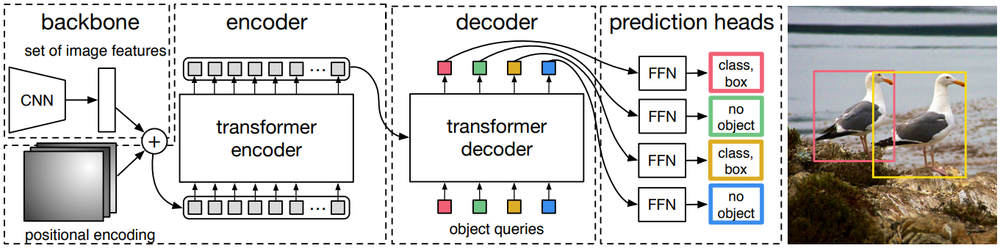

[DETR 논문 리뷰](https://kimjy99.github.io/%EB%85%BC%EB%AC%B8%EB%A6%AC%EB%B7%B0/detr/)
[Swin 논문 리뷰](https://kimjy99.github.io/%EB%85%BC%EB%AC%B8%EB%A6%AC%EB%B7%B0/swin-transformer/)
BoostCampAITECH
{:.note title="출처 및 참고"}

* this unordered seed list will be replaced by the toc
{:toc}

# End-to-End Object Detection with Transformer(DETR; DEtection TRansformer)

- Transformer를 처음으로 Object Detection에 적용
- 기존의 hand-crafted post process 단계를 transformer를 이용하여 없앰

## Architecture

- **컴팩트한 feature 표현을 추출하기 위한 CNN backbone**
- **인코더-디코더 transformer**
- **최종 예측을 만드는 간단한 FFN**
    - 최종 예측은 ReLU 함수를 포함하는 hidden 차원이 d인 3-layer MLP와 linear projection layer로 계산
    - FFN은 입력 이미지에 대한 정규화 중심 좌표, 박스의 높이 및 너비를 예측하고 linear layer는 softmax 함수를 사용하여 클래스 레이블 예측

## Train

- groundtruth에서 부족한 object 개수만큼 no object로 padding 처리
- groundtruth와 prediction이 N:N 매핑
- 각 예측 값이 N개 unique하게 나타나 post-process 과정 불필요

# Swin Transformer

- ViT의 문제점
    - ViT의 실험부분을 보면 굉장히 많은 양의 Data를 학습해야 성능이 나옴
    - Transformer 특성상 computational cost 큼
    - 일반적인 backbone으로 사용하기 어려움

을 CNN과 유사한 구조로 설계, Window라는 개념을 활용해서 cost를 줄이는 방식으로 해결함

## Architecture

- **Patch Partition으로 분할**, 구현에서는 4x4의 패치 크기를 사용하므로 각 패치의 feature 차원은 4x4x3=48
- 이 feature에 **선형 임베딩 레이어를 적용**하여 임의의 차원 C로 project
- **수정된 self-attention 계산(Swin Transformer Block)이 포함된 여러 Transformer 블록**이 이러한 패치 토큰에 적용되며 Transformer 블록은 토큰 수 ($$\frac{H}{4}$$x$$\frac{W}{4}$$)를 유지하며 선형 임베딩과 함께 **“1단계”라고 불리움**
- 계층적 표현을 생성하기 위해 네트워크가 깊어짐에 따라 레이어를 **Patch Merging**하여 토큰 수를 줄임

첫 번째 패치 병합 레이어는 2x2 인접 패치의 각 그룹의 feature를 concat하고 4C 차원의 concat된 feature에 linear layer를 적용

4의 배수만큼 토큰 수가 줄어들고 출력 차원은 2C로 설정됨

Swin Transformer의 블록은 ($$\frac{H}{8}$$x$$\frac{W}{8}$$)에서 해상도를 유지하면서 feature 변환을 위해 나중에 적용됨

이 패치 병합 및 feature 변환의 첫 번째 블록은 “2단계”라고 불리움

이 절차는 각각 ($$\frac{H}{16}$$x$$\frac{W}{16}$$), ($$\frac{H}{32}$$x$$\frac{W}{32}$$)의 출력 해상도로 “3단계”, “4단계”로 두 번 반복됨

이런 단계는 일반적인 convolution network(Ex. VGG, ResNet)와 동일한 feature map 해상도로 계층적 표현을 공동으로 생성

### Patch Partitioning

입력 이미지를 작은 patch로 분할하여 입력 RGB 이미지를 겹치지 않는 패치로 분할, 각 패치는 “토큰”으로 취급되며 해당 feature는 픽셀 RGB 값의 concatenation으로 설정됨

### Linear Embedding

ViT와 embedding 방식은 동일하지만 class embedding은 제거

### Swin Transformer Block

Transformer 블록의 multi-head self-attetnion(MSA) 모듈을 **shifted window를 기반으로하는 모듈로 교체**

- **Window Multi-head Attention(W-MSA)**
    
    
    
    - Window 단위로 Embedding을 나눔
    - 기존 ViT 같은 경우 모든 embedding을 Transformer에 입력
    - Swin-Transformer는 Window 안에서만 Transformer 연산 수행
    - **따라서 이미지 크기에 따라 증가되던 computational cost가 Window 크기에 따라 조절이 가능함**
    - **Window 안에서만 수행하여 receptive field를 제한하는 단점이 존재함**

- **Shifted Window Multi-Head Attention(SW-MSA)**
    
    
    
    - W-MSA의 경우 Window 안에서만 수행하여 receptive filed를 제한하는 단점이 존재**(window 간의 연결이 부족해서 모델링 능력이 제한됨)**하는데 **이를 해결하기 위해서 SW-MSA를 Transformer Block 2번째 layer에서 수행**
    - Shifted Window 파티셔닝은 더 많은 window를 만들며, 일부 창은 MxM보다 작아야 함 → **Window size와 다르게 나뉜 부분들 해결이 필요함**
        - 제일 Native한 해결책으로는 attention을 계산할 때 더 작은 window를 MxM 크기로 채우고 패딩된 값을 마스킹하는 것 → 일반 파티셔닝 window 수가 적은 경우 이 native한 솔루션으로 증가된 계산은 상당함 → 2x2의 경우 3x3이 되어 window의 수가 2.25배 커짐
        
        
        
        - **위 그림처럼 왼쪽 위 방향으로 순환 이동(cyclic-shifting)하고, 남는 부분을 masking 처리하여 self-attention 연산이 되지 않도록 함**
        - cyclic-shifting를 사용하면 배치된 window의 수가 일반 window 파티션과 동일하게 유지되므로 효율적

### Patch Merging

## 정리

- 적은 Data에도 학습이 잘 이루어짐
- Window 단위를 이용하여 computation cost를 대폭 줄임
- CNN과 비슷한 구조로 Object Detection, Segmentation 등의 backbone으로 general하게 활용