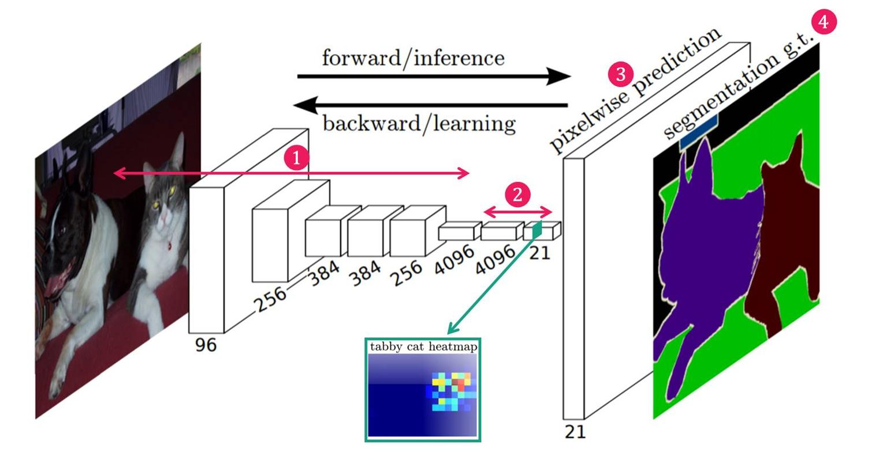

[FCN(Fully Convolution Network)](https://velog.io/@cha-suyeon/%EB%94%A5%EB%9F%AC%EB%8B%9D-Segmentation3-FCNFully-Convolution-Network)
[FCN 논문 리뷰 — Fully Convolutional Networks for Semantic Segmentation](https://medium.com/@msmapark2/fcn-%EB%85%BC%EB%AC%B8-%EB%A6%AC%EB%B7%B0-fully-convolutional-networks-for-semantic-segmentation-81f016d76204)
[FCN](https://wikidocs.net/147359)
BoostCampAITECH
{:.note title="출처 및 참고"}

* this unordered seed list will be replaced by the toc
{:toc}

# Fully Convolutional Networks for Semantic Segmentation(FCN)의 기본 개념과 구조

**Semantic Segmentation 모델을 위해**

**기존의 image classification에서 우수한 성능을 보인 CNN 기반 모델을 변형시킨 구조**



1. **VGG 네트워크 백본을 사용**: 다양한 모델 중 VGG가 가장 좋은 성능을 보였다고 함
2. **VGG 네트워크의 FC Layer(nn.Linear)를 Convolution으로 대체**: 위치 정보를 보존하기 위함
3. **Transposed Convolution을 이용하여 Pixel Wise Prediction을 수행함**


이미지의 feature를 추출하기 위한 네트워크의 뒷단에 fully connected layer를 붙여, 계산한 class 별 확률을 바탕으로 image classficiation을 수행

**→ FCN에서는 Segmentation을 하기 위해서 fully connected layer가 아닌 CNN을 붙임**


VGG 16을 예시로 보면

**뒤의 3 Dense Layers가 모두 Conv-layer로 변경**: 원래 CNN 구조는 network의 input layer에서 중간 부분까지는 ConvNet을 이용하여 영상의 feature를 추출하고, 해당 feature를 ouptu layer 부분에서 FC-Layer를 통해 이미지를 분류했음

Segmentation의 목적은 원본 이미지의 각 pixel에 대해 클래스를 구분하고 instance와 background를 분할해야하므로 **위치 정보가 매우 중요해서 위치 정보를 유지하면서 Class 단위의 feature map을 얻어 segmentation하기 위해 CNN으로 대체**

Dense Layer에서 Conv Layer로 변환하는 방식은 다음과 같으며 첫 번째 fully-connected layer를 (7x7x512) 4096 filter conv 로 변환하면 가중치의 수가 유지됨


마지막 FC-Layer의 경우 채널 차원을 클래스에 맞춘 1x1 conv로 변환


다섯 번째 max-pooling(size:2x2, stride:2) 연산 후 feature map의 크기는 7x7이 됨(입력 이미지의 크기가 224x224인 경우) Feature map의 크기는 일반적으로 원본 이미지보다 작음

Convolutionalization을 통해서 출력 feature map은 원본 이미지의 위치 정보를 내포할 수 있게 되었지만 픽셀 단위 예측과 비교했을 때 **FCN의 출력 feature map은 너무 coarse(거친, 알맹이가 큰) 특성을 가지게 됨**

Coarse map을 **원본 이미지 크기에 가까운 Dense map으로 변환해 줄 필요**가 있으며 적어도 input image size * 1/32 보다는 해상도가 높을 필요가 있음

해결 방법으로 Coarse map에서 Dense map을 얻는 방법으로는 Interpolation, Deconvolution, Unpooling, Shift and stitch와 같이 있음

Pooling을 안쓰거나 stride를 줄여서 feature map을 줄이면 더 세밀한 부분을 볼 수 있지만 receptive field가 줄어들어서 이미지의 context를 놓치게 되며, Pooling을 하는 이유 중 하나인 특징맵의 크기를 줄여서 파라미터 수를 줄이고 학습시간을 줄이려한 의도가 없어짐

**FCNs에서는 아래의 두가지의 방법을 사용하여 Coarse Feature map으로부터 Dense prediction을 구했음**

1. **Bilinear Interpolation**
2. **Backwards convolution**
    
    
    

초기 Segmentation을 위한 모델(FCN-32s)은 다음과 같이 VGG모델을 컨볼루션화한 구조에 Bilinear interpolation 작업을 더함으로써 얻을 수 있었는데 **feature map의 크기가 너무 작아서 dense map의 정보는 여전히 거침**


stride가 32인 up-sampling 과정에서 많은 정보가 손실되었기 때문에 **Skip Architecture를 적용**

아래의 그림들은 FCN-16s, FCN-8s로 Skip Architecture를 적용한 것

**각 Pooling에 Prediction을 위해 추가된 Conv layer의 필터는 0으로, Trainable Backwards convolution은 Bilinear interpolation으로 초기화한 후 학습을 진행하여 개선된 segmentation 결과를 얻을 수 있었음**


실제 성능 지표에서도 FCN-32s → FCN-16s → FCN-8s 순서로 결과가 나아지는 것을 확인할 수 있음


# FC Layer와 Conv Layer의 차이점

**FC Layer의 한계점**

1. **이미지의 위치 정보가 사라짐**
    
    
    
    FC Layer를 Convolution layer로 바꿈으로써 위치 정보를 해치지 않은 상태로 특징 추출이 가능해짐
    
2. **input image의 사이즈가 고정되어 있음**
    
    1x1 Convolution을 사용
    
    
    
    임의의 입력값에 대해서도 상관이 없음, Convolution은 kernel의 파라미터에 의해 영향을 받고, 이미지 혹은 레이어의 크기에 대해서는 상관이 없기 때문
    

# Transposed Convolution의 원리

## 정의

- Convolution과 마찬가지로 학습이 가능한 파라미터를 통해서 줄어든 이미지를 다시 키우는 Convolution
- **Transposed Convolution의 값은 이전 Convoultion의 값과 동일한 값이 아닌 Convolution처럼 학습이 가능한 파라미터, Backpropagation 과정에서 업데이트 되는 값임**

**Upsampling == Deconvolution == Transposed Convolution 모두 동일하게 쓰이지만 Transposed Convolution이 가장 정확한 표현임**

- Deconvolution이라는 단어는 Conv의 input과 Deconv의 output이 동일하지 않아서 정확하게 맞는 표현은 아님(하지만 같이 자주 사용함)
- Transposed Convolution으로 표현하는 이유는 Convolution을 한 결과를 Transpose하여 Convolution을 진행했을 때 같은 결과가 나오기 때문임

## 과정

각각의 input 픽셀과 kernel 픽셀을 stride만큼 이동하여 elementwise product를 수행한 후에 같은 위치의 값은 모두 summation


- 5x5 output: stride2
- 5x5 output, padding1: 3x3

### Convolution


### Transposed convolution


# Skip Architecture를 통한 성능 향상 방법

FCN-32s가 GT와 비교했을 때 디테일을 잘 예측하지 못함

중간에 pooling의 output 값을 Deconvolution 과정에서 사용하기로 함

1. MaxPooling에 의해서 잃어버린 정보를 복원해주는 작업을 진행
2. Upsampled Size를 줄여주기에 좀 더 효율적인 이미지 복원이 가능

# FCN 모델 구현

**ConvTranspose2d**: PyTorch에서 Transposed Convolution 또는 Deconvolution 연산을 수행하는 2D 레이어로, Conv2d와 반대로 작동

## FCN-32s

```python
class FCN32s(nn.Module):
    def __init__(self, num_classes=len(CLASSES)):
        super(FCN32s, self).__init__()

        # Conv + ReLU
        def CBR(in_channels, out_channels, kernel_size=3, stride=1, padding=1):
            return nn.Sequential(
                nn.Conv2d(in_channels=in_channels,
                          out_channels=out_channels,
                          kernel_size=kernel_size,
                          stride=stride,
                          padding=padding),
                nn.ReLU(inplace=True)
            )

        # conv1: 입력(3채널) → 64채널 → 64채널 → maxpool
        self.conv1_1 = CBR(3, 64, 3, 1, 1)
        self.conv1_2 = CBR(64, 64, 3, 1, 1)
        self.pool1 = nn.MaxPool2d(2, stride=2, ceil_mode=True)  # 출력 해상도 1/2

        # conv2: 64 → 128 → 128 → maxpool
        self.conv2_1 = CBR(64, 128, 3, 1, 1)
        self.conv2_2 = CBR(128, 128, 3, 1, 1)
        self.pool2 = nn.MaxPool2d(2, stride=2, ceil_mode=True)  # 출력 해상도 1/4

        # conv3: 128 → 256 → 256 → 256 → maxpool
        self.conv3_1 = CBR(128, 256, 3, 1, 1)
        self.conv3_2 = CBR(256, 256, 3, 1, 1)
        self.conv3_3 = CBR(256, 256, 3, 1, 1)
        self.pool3 = nn.MaxPool2d(2, stride=2, ceil_mode=True)  # 출력 해상도 1/8

        # conv4: 256 → 512 → 512 → 512 → maxpool
        self.conv4_1 = CBR(256, 512, 3, 1, 1)
        self.conv4_2 = CBR(512, 512, 3, 1, 1)
        self.conv4_3 = CBR(512, 512, 3, 1, 1)
        self.pool4 = nn.MaxPool2d(2, stride=2, ceil_mode=True)  # 출력 해상도 1/16

        # conv5: 512 → 512 → 512 → 512 → maxpool
        self.conv5_1 = CBR(512, 512, 3, 1, 1)
        self.conv5_2 = CBR(512, 512, 3, 1, 1)
        self.conv5_3 = CBR(512, 512, 3, 1, 1)
        self.pool5 = nn.MaxPool2d(2, stride=2, ceil_mode=True)  # 출력 해상도 1/32

        # FC6: conv 대신 1x1 conv 사용 (VGG의 fc6을 conv로 치환)
        self.fc6 = CBR(512, 4096, 1, 1, 0)  # 크기 유지, 채널만 증가
        self.drop6 = nn.Dropout2d()        # dropout regularization

        # FC7: fc6과 동일하게 처리
        self.fc7 = CBR(4096, 4096, 1, 1, 0)
        self.drop7 = nn.Dropout2d()

        # score layer: 4096 → num_classes (1x1 conv로 클래스 수만큼 채널 줄임)
        self.score_fr = nn.Conv2d(4096, num_classes, kernel_size=1, stride=1, padding=0)

        # upsampling layer: Transposed Conv 사용 (32배 업샘플링)
        self.upscore32 = nn.ConvTranspose2d(
            num_classes,             # 입력 채널 수
            num_classes,             # 출력 채널 수 (segmentation map)
            kernel_size=64,          # 커널 크기
            stride=32,               # 32배 업샘플링
            padding=16               # padding 조정으로 정확한 크기 복원
        )

    def forward(self, x):
        # VGG 구조와 동일한 인코더
        h = self.conv1_1(x)
        h = self.conv1_2(h)
        h = self.pool1(h)

        h = self.conv2_1(h)
        h = self.conv2_2(h)
        h = self.pool2(h)

        h = self.conv3_1(h)
        h = self.conv3_2(h)
        h = self.conv3_3(h)
        h = self.pool3(h)

        h = self.conv4_1(h)
        h = self.conv4_2(h)
        h = self.conv4_3(h)
        h = self.pool4(h)

        h = self.conv5_1(h)
        h = self.conv5_2(h)
        h = self.conv5_3(h)
        h = self.pool5(h)

        # Fully convolutional layers
        h = self.fc6(h)
        h = self.drop6(h)

        h = self.fc7(h)
        h = self.drop7(h)

        h = self.score_fr(h)       # class score map

        upscore32 = self.upscore32(h)  # 32배 업샘플링 → 입력 크기 복원

        return upscore32           # shape: (N, num_classes, H, W)

```

## FCN-16s

```python
class FCN16s(nn.Module):
    def __init__(self, num_classes=len(CLASSES)):
        super(FCN16s, self).__init__()
        self.relu = nn.ReLU(inplace=True)

        # Conv + ReLU
        def CBR(in_channels, out_channels, kernel_size=3, stride=1, padding=1):
            return nn.Sequential(
                nn.Conv2d(in_channels=in_channels,
                          out_channels=out_channels,
                          kernel_size=kernel_size,
                          stride=stride,
                          padding=padding),
                nn.ReLU(inplace=True)
            )

        # conv1: 3 → 64 → 64 → pooling (1/2)
        self.conv1_1 = CBR(3, 64)
        self.conv1_2 = CBR(64, 64)
        self.pool1 = nn.MaxPool2d(2, stride=2, ceil_mode=True)

        # conv2: 64 → 128 → 128 → pooling (1/4)
        self.conv2_1 = CBR(64, 128)
        self.conv2_2 = CBR(128, 128)
        self.pool2 = nn.MaxPool2d(2, stride=2, ceil_mode=True)

        # conv3: 128 → 256 → 256 → 256 → pooling (1/8)
        self.conv3_1 = CBR(128, 256)
        self.conv3_2 = CBR(256, 256)
        self.conv3_3 = CBR(256, 256)
        self.pool3 = nn.MaxPool2d(2, stride=2, ceil_mode=True)

        # conv4: 256 → 512 → 512 → 512 → pooling (1/16)
        self.conv4_1 = CBR(256, 512)
        self.conv4_2 = CBR(512, 512)
        self.conv4_3 = CBR(512, 512)
        self.pool4 = nn.MaxPool2d(2, stride=2, ceil_mode=True)

        # pool4 이후 feature map을 1x1 conv로 클래스 수만큼 줄임
        self.score_pool4_fr = nn.Conv2d(512, num_classes, kernel_size=1)

        # conv5: 512 → 512 → 512 → 512 → pooling (1/32)
        self.conv5_1 = CBR(512, 512)
        self.conv5_2 = CBR(512, 512)
        self.conv5_3 = CBR(512, 512)
        self.pool5 = nn.MaxPool2d(2, stride=2, ceil_mode=True)

        # fully conv layers (FC6, FC7을 conv로 대체)
        self.fc6 = nn.Conv2d(512, 4096, 1)
        self.relu6 = nn.ReLU(inplace=True)
        self.drop6 = nn.Dropout2d()

        self.fc7 = nn.Conv2d(4096, 4096, 1)
        self.relu7 = nn.ReLU(inplace=True)
        self.drop7 = nn.Dropout2d()

        # 최종 score map 출력 (4096 → 클래스 수)
        self.score_fr = nn.Conv2d(4096, num_classes, kernel_size=1)

        # Deconv: 1/32에서 1/16로 업샘플링
        self.upscore2 = nn.ConvTranspose2d(num_classes, num_classes,
                                           kernel_size=4, stride=2, padding=1)

        # Deconv: 1/16에서 원본 해상도 복원
        self.upscore16 = nn.ConvTranspose2d(num_classes, num_classes,
                                            kernel_size=32, stride=16, padding=8)

    def forward(self, x):
        # 인코더: VGG와 동일한 구조
        h = self.conv1_1(x)
        h = self.conv1_2(h)
        h = self.pool1(h)

        h = self.conv2_1(h)
        h = self.conv2_2(h)
        h = self.pool2(h)

        h = self.conv3_1(h)
        h = self.conv3_2(h)
        h = self.conv3_3(h)
        h = self.pool3(h)

        h = self.conv4_1(h)
        h = self.conv4_2(h)
        h = self.conv4_3(h)
        pool4 = h = self.pool4(h)  # skip connection용 저장

        score_pool4c = self.score_pool4_fr(pool4)  # pool4 특징에 대해 1x1 conv

        h = self.conv5_1(h)
        h = self.conv5_2(h)
        h = self.conv5_3(h)
        h = self.pool5(h)

        h = self.fc6(h)
        h = self.relu6(h)
        h = self.drop6(h)

        h = self.fc7(h)
        h = self.relu7(h)
        h = self.drop7(h)

        h = self.score_fr(h)  # 클래스 점수 맵

        upscore2 = self.upscore2(h)  # 1/32 → 1/16 업샘플링

        h = upscore2 + score_pool4c  # skip connection 결합

        upscore16 = self.upscore16(h)  # 1/16 → 원본 해상도 복원

        return upscore16  # shape: (N, num_classes, H, W)

```

## FCN-8s


```python
class FCN8s(nn.Module):
    def __init__(self, num_classes=len(CLASSES)):
        super(FCN8s, self).__init__()

        # Conv + ReLU
        def CBR(in_channels, out_channels, kernel_size=3, stride=1, padding=1):
            return nn.Sequential(
                nn.Conv2d(in_channels=in_channels,
                          out_channels=out_channels,
                          kernel_size=kernel_size,
                          stride=stride,
                          padding=padding),
                nn.ReLU(inplace=True)
            )

        # conv1: 입력 → 64 → 64 → pooling (1/2)
        self.conv1_1 = CBR(3, 64)
        self.conv1_2 = CBR(64, 64)
        self.pool1 = nn.MaxPool2d(2, stride=2, ceil_mode=True)

        # conv2: 64 → 128 → 128 → pooling (1/4)
        self.conv2_1 = CBR(64, 128)
        self.conv2_2 = CBR(128, 128)
        self.pool2 = nn.MaxPool2d(2, stride=2, ceil_mode=True)

        # conv3: 128 → 256 → 256 → 256 → pooling (1/8)
        self.conv3_1 = CBR(128, 256)
        self.conv3_2 = CBR(256, 256)
        self.conv3_3 = CBR(256, 256)
        self.pool3 = nn.MaxPool2d(2, stride=2, ceil_mode=True)

        # pool3 후 feature를 1x1 conv로 클래스 수 채널로 줄임 (skip 연결용)
        self.score_pool3_fr = nn.Conv2d(256, num_classes, kernel_size=1)

        # conv4: 256 → 512 → 512 → 512 → pooling (1/16)
        self.conv4_1 = CBR(256, 512)
        self.conv4_2 = CBR(512, 512)
        self.conv4_3 = CBR(512, 512)
        self.pool4 = nn.MaxPool2d(2, stride=2, ceil_mode=True)

        # pool4 후 feature를 1x1 conv로 줄임 (skip 연결용)
        self.score_pool4_fr = nn.Conv2d(512, num_classes, kernel_size=1)

        # conv5: 512 → 512 → 512 → pooling (1/32)
        self.conv5_1 = CBR(512, 512)
        self.conv5_2 = CBR(512, 512)
        self.conv5_3 = CBR(512, 512)
        self.pool5 = nn.MaxPool2d(2, stride=2, ceil_mode=True)

        # fc6, fc7: fully conv layers
        self.fc6 = nn.Conv2d(512, 4096, 1)
        self.relu6 = nn.ReLU(inplace=True)
        self.drop6 = nn.Dropout2d()

        self.fc7 = nn.Conv2d(4096, 4096, 1)
        self.relu7 = nn.ReLU(inplace=True)
        self.drop7 = nn.Dropout2d()

        # 클래스 수만큼 score 출력
        self.score_fr = nn.Conv2d(4096, num_classes, kernel_size=1)

        # 업샘플링 연산 정의
        # 1/32 → 1/16
        self.upscore2 = nn.ConvTranspose2d(num_classes, num_classes,
                                           kernel_size=4, stride=2, padding=1)

        # 1/16 → 1/8
        self.upscore2_pool4 = nn.ConvTranspose2d(num_classes, num_classes,
                                                 kernel_size=4, stride=2, padding=1)

        # 1/8 → 원본 해상도
        self.upscore8 = nn.ConvTranspose2d(num_classes, num_classes,
                                           kernel_size=16, stride=8, padding=4)

    def forward(self, x):
        h = self.conv1_1(x)
        h = self.conv1_2(h)
        h = self.pool1(h)

        h = self.conv2_1(h)
        h = self.conv2_2(h)
        h = self.pool2(h)

        h = self.conv3_1(h)
        h = self.conv3_2(h)
        h = self.conv3_3(h)
        pool3 = h = self.pool3(h)  # 1/8 크기, skip 연결용

        score_pool3c = self.score_pool3_fr(pool3)  # 클래스 수 채널로 줄임

        h = self.conv4_1(h)
        h = self.conv4_2(h)
        h = self.conv4_3(h)
        pool4 = h = self.pool4(h)  # 1/16 크기, skip 연결용

        score_pool4c = self.score_pool4_fr(pool4)

        h = self.conv5_1(h)
        h = self.conv5_2(h)
        h = self.conv5_3(h)
        h = self.pool5(h)  # 1/32 크기

        h = self.fc6(h)
        h = self.relu6(h)
        h = self.drop6(h)

        h = self.fc7(h)
        h = self.relu7(h)
        h = self.drop7(h)

        h = self.score_fr(h)  # 클래스 점수 맵

        upscore2 = self.upscore2(h)  # 1/32 → 1/16

        h = upscore2 + score_pool4c  # skip 연결 (pool4)

        upscore2_pool4c = self.upscore2_pool4(h)  # 1/16 → 1/8

        h = upscore2_pool4c + score_pool3c  # skip 연결 (pool3)

        upscore8 = self.upscore8(h)  # 1/8 → 원본 해상도

        return upscore8  # shape: (N, num_classes, H, W)
```