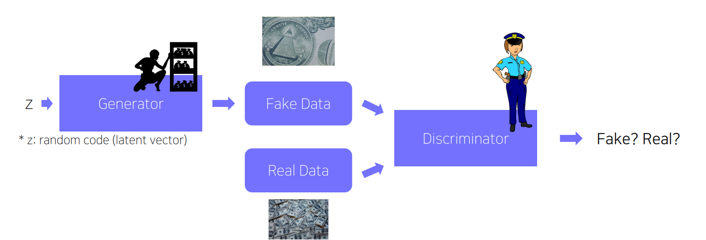

BoostCampAITECH
{:.note title="출처 및 참고"}

* this unordered seed list will be replaced by the toc
{:toc}

# Conditional Generative Model

**Conditional generative model이란 condition(조건)이 주어졌을 때 그에 대응하는 output을 generate하는 모델을 말함**

예시로 audio super resolution, machine translation, article generaation with the title로 활용됨

## Generative Adversarial Network(GAN)

“Criminal” (Generator) crafts, and“Police”(Discriminator) detects counterfeit

- Adversarial train(적대적 학습법): Generator는 Fake data를 더 잘 만들기 위해서 학습하고 Discriminator는 Fake data와 Real data를 더 잘 구분하기 위해 학습함으로써 둘 다의 성능이 올라감

## GAN VS Conditonal GAN

기존에는 random sampling을 통해 X에 해당하는 이미지 생성

Conditional generative model은 주어진 condition을 고려한 sampling을 통해 이미지를 생성해내므로 사용자의 의도를 반영한 생성 모델로 높은 활용 가능성을 가짐

구조를 비교해보면 Conditonal GAN의 입력에 **condition c가 주어진다는 점의 차이가 존재**

# Conditional GAN and image translation

- **image-to-image translation**
    - Translating an image into another image: Style transfer, Super resolution, Colorization…
        
        
        

# Super resolution

- **low resolution to high resolution**
    - input: Low resolution image
    - output: High resolution image corresponding to the input image

**LR 이미지를 입력으로 받아서 Generator에서 HR 이미지를 생성하고 생성된 HR이미지와 실제 HR이미지를 D에서 비교하고 학습할 때 G는 perceptual 및 adversarial loss를 통해서 시각적으로 선명하고 사실적인 HR 이미지를 생성하게 됨**

**MAE(Mean Absolute Error) 또는 MSE(Mean Squared Error)**를 사용했을 때 모델은 loss를 최소화하는 방향으로 학습하고, regression model은 image data의 평균치를 계산하려는 경향이 강하게 학습이 됨 → **평균적인 픽셀값을 추정하므로 결과 이미지가 흐릿함**

**GAN** 모델의 경우 real image와 fake image를 판별해내는 D가 있기 때문에 G는 image data의 평균치와 상관없이 real image와 유사하게 생성 → **보다 선명하고 세부적인 HR 이미지를 생성함**

MAE/MSE는 픽셀의 intensity의 차이를 계산하므로 많은 패치들이 존재함

## **Meaning of “averging answers” by an example**

- Conditions
    - Task: Colorzing the given image
    - Real image has only two colors, “black” or “white”
- L1 loss는 gray output을 낼 확률이 높음, 흰색과 검은색의 average
- GAN loss는 black or white의 output을 생성, real data를 통해 학습하기에 본 적이 없는 data를 generate할 확률이 높음

## **GAN loss for Super Resolution(SRGAN)**

- SRGAN geanerates more “realistic” and sharp imags than SRResNet(MSE loss)
    
    
    

# Image translation GANs

Image translation은 input image를 다른 도메인의 output image로 생성해내는 것(ex. 스타일 변환)으로 아래는 입력 이미지가 조건으로 주어지는 Conditional GAN의 예시

## Pix2Pix

2017년에 발표된 image translation을 위한 모델로 **Loss function에 cGAN loss와 L1 loss를 함께 사용**

앞의 내용처럼 L1 loss만을 사용하면 blurry image가 생성, GAN loss는 실제 분포에 가까운 사실적인 output을 유도함

**Real data와 비슷한 생성은 cGAN loss에 의해서 학습되고, L1 loss는 target domain의 real data와 크게 벗어나지 않도록 하는 가이드 역할을 하는 것임**

아래와 같이 L1+cGAN loss를 사용했을 때 real image 같으면서도 target domain에 가까운 이미지가 생성된 것을 볼 수 있음

## CycleGAN

Pix2Pix는 “pairewsie data”가 준비되어있어야 했고 supervised learning이 가능했음, **항상 paired dataset을 준비하기는 어려워서 이를 해결한 모델**

- 쌍이 아닌 dataset을 사용해서 도메인 간 변환을 가능하게 함(모네 초상화, 실제 사진) 간의 직접적인 대응은 필요하지 않음
- non-pairwise dataset을 많이 주고 그 사이 관계 왔다갔다하면서 학습함

### Loss function of CycleGAN

- **CycleGAN loss** = GAN loss(in both direction) + **Cycle-consistency loss**
    
    
    
- **GAN loss**: Translate an image in domain A to B, and vice versa(반대로도 변환) → **domain간 변화 시 얼마나 target domain이 real data같은지**
- **Cycle-consistency loss**: Enforce the fact that an image and its manipulated one by going back-and-forth should be same(이미지와 조작된 이미지가 동일해야 한다는 사실을 반복해서 적용) → **기존 이미지(X)와 변환 후에 이미지(X→Y→X)가 얼마나 유사한지**

### GAN loss in CycleGAN

- GAN loss does translation
- CycleGAN has two GAN losses, in both direction(X→Y, Y→X)
- GAN loss: $$L(D_X) + L(D_Y) + L(G) + L(F)$$
- G, F: generator
- $$D_X, D_Y$$: discriminator

### If we solely use GAN loss

- **Mode Collapse 문제가 발생함**: input에 상관없이 하나의 output만 계속 출력함
    
    
    
- X→Y generator가 생성한 이미지가 맞다고 판단하고 더이상 학습하지 않음

**→ Cycle-consistency loss to preserve contents!**

GAN loss를 보완하기 위해서 기존 이미지(X)와 변환 후 이미지(X→Y→X)가 서로 유사하도록 학습하게 함, 이런 과정을 거치면서 정보 유지

X에 대해 y가 매칭되어있지 않아도 되고, 단지 두 도메인의 데이터만 충분하게 주어져있으면 되기 때문에 Self-Supervisied model이라고 할 수 있음

### Perceptual loss

GAN은 학습하기가 어려움

- **GAN loss**
    - Relatively hard to train and code(G & D adversarially improve)
    - **Do not require any pre-trained networks**
    - Since no pre-trained network is required, can be applied to various applications
- **Preceptual loss**
    - **Simple to train and code(trained only with saimple forward & backward computation)**
    - Requiring a pre-trained network to measure a learned loss

- pretrained된 분류기들은 인간의 시각 지각과 유사한 필터 반응을 보임
- 이러한 사전 학습된 지각(preception)을 활용함으로써 이미지를 지각적 공간(perceptual space)로 변환할 수 있음

### Perceptual loss를 사용하는 GAN의 학습

- Image Transform Net: 입력 이미지로부터 변환된 이미지를 출력하는 네트워크
- Loss Network: 생성된 이미지와 목표(target) 이미지 간의 스타일 손실 및 특징 손실을 계산
    - 일반적으로 ImageNet에서 사전 학습된 VGG 모델 사용
    - Image Transform Net을 학습할 때 Loss Network는 고정됨 (학습되지 않음)

**Perceptual loss를 사용하는 GAN에서는 Content Target과 Style Target의 존재가 핵심이고 이를 통해서 이미지의 style과 context를 보존하고자 하는 loss**

### Feature reconstruction loss

- y와 content target y_c를 통과시켜 loss를 구하고 계산
- **Conent target(보통 변환 전 이미지인 X를 그대로 입력에 사용)에 있는 내용물이 변환 후 이미지인 Transformed image에도 그대로 들어가 있는지를 검사**
- 두 이미지에서 CNN이 각각 feature map을  뽑아서, feature map들 간의 L2 loss를 loss 값으로 사용

### Style reconstruction loss

- y와 style target y_s를 통과시켜 loss를 구하고 계산
- **Style target(target domain에 있는 임의의 이미지를 입력으로 사용)에 있는 스타일 변환 후 이미지인 Transformed image에도 반영되어 있는지 검사**
- CNN을 이용해서 두 이미지에 대한 feature map을 뽑는데 이 feature map으로부터 ‘style’를 뽑아내기 위하여 한 번의 연산을 더 수행(Gram matrix를 계산하는 연산)
- Gram Matrix: 가로축 채널과 세로축 채널이 공통적으로 발견되는지 그 연관성의 정도를 나타내는 matrix

# Various GAN applications

GAN을 이용한 사례

1. Deepfake
    1. 영상 속 사람의 얼굴이나 음성을 다른 얼굴이나 음성으로 변환
2. Face de-identification
    1. 사람 얼굴 이미지를 약간 수정하여 개인정보보호
    2. 결과는 사람과 비슷해보이지만 컴퓨터가 같은 사람으로 식별하기 어려움
3. Face anonymization with passcode
    1. 특정 암호로 인간 얼굴 식별 해제
    2. 패스 코드를 가진 권한이 있는 사람만이 복호화하고 원본 이미지를 얻을 수 있음
4. Pose/Video Translation