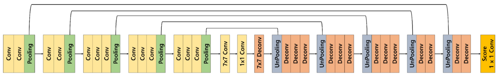

[DeconvNet 리뷰](https://deep-learning-study.tistory.com/565)
[여러 유형의 Convolution](https://zzsza.github.io/data/2018/02/23/introduction-convolution/)
BoostCampAITECH
{:.note title="출처 및 참고"}

* this unordered seed list will be replaced by the toc
{:toc}

# FCN의 한계점

1. **객체의 크기가 크거나 작은 경우 예측을 잘 하지 못함**
    - 큰 오브젝트의 경우 지역적인 정보만으로 예측함: 유리창에 비친 자전거를 인식하는 문제
    - 같은 오브젝트여도 다르게 라벨링
    - 작은 오브젝트 무시
2. **Object의 디테일한 모습이 사라지는 문제**
    - Deconvolution 절차가 간단해서 경계를 학습하기에 어려움

이러한 문제를 해결하기 위한 방법으로 **Decoder 개선, Skip Connection 적용**, Receptive Field 확장한 모델들에 대해서 살펴봄

# Decoder를 개선한 모델

## DeconvNet

### Architecture

Decoder를 Encoder와 대칭으로 만든 형태

- Convolution Network는 VGG16을 사용
- Deconvolution Network는 Unpooling, Deconvolution, ReLU로 이뤄짐

**Decoder를 보면 Unpooling과 Transposed Convolution이 반복적으로 이뤄짐**

- Unpooling으로 디테일한 경계를 포착
- Transposed Convolution은 전반적인 모습을 포착

**Pooling의 경우** 노이즈를 제거하는 장점이 있지만, 그 과정에서 **정보가 손실됨**

그렇기 때문에 **Unpooling을 통해서** Pooling시에 지워진 경계에 정보를 기록했다가 **복원함, 학습이 필요없어서 속도가 빠름**

하지만 **unpooling 과정을 거치면 피쳐맵의 크기가 확대되고, sparse(부족)한 값(대부분이 0)을 갖는 activation map이 됨**

이를 **채워주는 Transposed Convolution를 통해서 dense feature map을 만듦**

### Unpooling

max pooling 연산을 할 때, max value의 index를 저장, unpooling할 때 저장한 index에 max value를 복원

### Deconvolution (Transposed Convolution)

입력 크기 2x2, 커널 3x3이고 곱해져서 아래처럼 배치되고 겹치는 부분을 더하여 deconvolution 연산을 수행

### Analysis of DeconvNet

- Low layer는 직선 및 곡선, 색상 등의 낮은 수준의 특징(local feature)
- High layer는 복잡하고 포괄적인 개체 정보가 활성화(global feature)

Deconvolution Network의 Activation map을 보면 층과 pooling 방법에 따라 다른 특징이 있음(순차적인 층의 구조가 다양한 수준의 모양을 잡아냄)

- Unpooling의 경우 “example-specific”한 구조를 잡아냄(자세한 구조)
- Trnasposed Conv의 경우 “class-specific”한 구조를 잡아냄(위의 구조에 빈 부분을 채워넣음)
    - 둘을 병행했을 때 실제로 FCN보다 DeconvNet의 활성화 맵이 디테일해지는 모습을 보임

## SegNet

Road Scene Understanding applications라는 분야에서 Semantic Semgnetation을 수행하기 위해 모델이 필요한 능력에 대한 고민(자율 주행에 있어서 차량, 도로, 차선, 하늘, 사람 등의 **클래스를 빠르고 정확하게 구분해야 함**)

- DeconvNet과의 차이점
    - DeconvNet 중간의 7x7 conv - 1x1 conv - 7x7 deconv를 제거 → **weight parameter 감소를 통해 학습 및 추론 시간을 감소시킴**
    - **Decoder에서** Deconvolution이 아닌 **Convolution을 적용함**
        
        
        

# Skip Connection을 적용한 모델

**Skip Connection**: ResNet에서 적용했던 것으로 Neural Network에서 이전 layer의 output을 일부 layer를 건너 뛴 후 layer에게 입력으로 제공하는 것

## FC DenseNet

- Dense Block 내부에서의 Skip Connection
- Encoder에서 Decoder로의 Skip Connection
- Dense Block에서는 DenseNet과 유사하게 이전 layer에서의 feature를 concat하여 사용

## Unet

FC DenseNet과 마찬가지로 Encoder에서 Decoder로의 Skip Connection이 존재