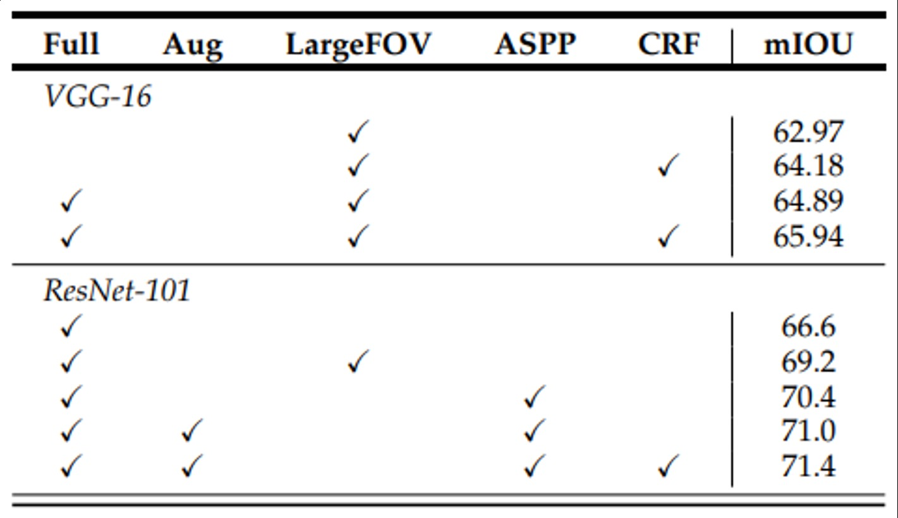

[ASPP](https://jaylala.tistory.com/entry/%EA%B0%9C%EB%85%90%EC%A0%95%EB%A6%AC-ASPP%EB%9E%80-Atrous-Spatial-Pyramid-Pooling-%EC%9D%B4%EB%9E%80)
[global contextual information](https://smcho1201.tistory.com/98)
BoostCampAITECH
{:.note title="출처 및 참고"}

* this unordered seed list will be replaced by the toc
{:toc}

저번 포스트에 이어 DeepLab 모델을 정리하고, PSPNet에 대해서도 정리

# DeepLab v2

- 더 깊은 **ResNet-101을** backbone으로 사용
- **Atrous Spatial Pyramid Pooling(ASPP)**를 적용하여 다양한 크기의 Receptive Feild를 가진 정보를 사용

ASPP를 쓴 건 1.2가 향상되었고 ResNet을 사용하였을 때 대폭 향상됨

## **Atrous Spatial Pyramid Pooling(ASPP)**

이미지의 다양한 크기와 해상도의 정보를 효과적으로 수집하고 활용하는데 도움을 주는 기법으로 다양한 dilation rate을 가진 dilated kernel을 활용하여 pyramid의 형식처럼 stacking하여 활용하는 방식을 의미

1. 다양한 확장 비율(dilation rate)를 가진 atrous conovlution 적용하여 multi scale의 파라미드 구조를 형성하고 이미지의 다양한 크기 정보를 포착
2. 각 확장 비율에서 추출된 feature map을 병합하여 다양한 크기의 특징 정보를 통합하고 전체적인 이미지 정보를 파악, element-wise summation이나 concatenation을 활용하여 통합함
3. 최종 결과 생성을 위한 convolution을 적용

feature map들이 병합되기 전, 또는 병합되고 나서 GAP가 적용됨

- 각 확장 비율별 특징 맵에 GAP가 적용되는 경우
    - 각기 다른 dilated rate로 도출된 이미지들의 global한 context를 추출하기 위해서 적용함
    - 이는 이미지 전체 정보와 세부 정보를 모두 고려할 수 있으며 더 정확한 segmentation 결과를 만들어 낼 수 있다는 점에서 좋지만, 계산량이 커지고 이로 인해서 모델의 크기 또한 커지는 현상이 발생
- ASPP 모듈 마지막 단계에서 ASP 적용(통합된 feature map에 적용)하는 경우
    - 각 크기의 정보`에 대한 이미지 전체 정보를 통합하는 것
    - 계산량이 적고 모델의 크기가 작지만 이미지 전체 정보를 고려해서 세부 정보 손실의 가능성이 있음

# PSPNet

비슷하지만 조금 다르게 receptive filed를 키운 아이디어로 아래의 FCN의 문제점을 해결

아래처럼 **global contextual information을 고려하지 않았을 때 문제가 발생**

1. **Mismatched Relationship**: 비슷한 외관을 잘못 예측하므로 주변의 특징을 고려하게
2. **Confusion Categories**: 건물에 비친 하늘과 건물을 혼돈하므로 카테고리간의 관계를 사용
3. **Inconspicuous Classes**: 작은 객체와 큰 객체가 겹쳐져 있거나 무늬가 비슷할 경우(pillow, bed sheet) 작은 객체들도 global contextual information을 사용

global infomration을 고려하기 위해서 pooling을 사용하고 대표적으로 max-pooling, avg-pooling이 존재하는데, **단순한 pooling 연산을 한다고해서 효과적으로 얻을 수 없음 →** 이론적으로 Pooling을 통해 얻는 receptive filed와 실제 receptive filed의 크기가 많이 다른데 pooling이 진행될 수록 그 정도가 심해지기 때문

PSPNet에서는 효과적으로 **global information을 얻기 위한 방법을 적용**

1. **input image에 CNN을 적용하여 feature map을 생성**하는데 Dilated Convolution을 적용한 ResNet을 사용
2. (b)의 feature map은 input image의 1/8 사이즈를 가짐
3. **1x1, 2x2, 3x3, 6x6 색깔별로 사이즈가 다른 max/avg-pooling 연산을 수행**
    1. 각 색에 sub-region을 가지도록 window size를 조절해서 pooling 연산을 진행하는데 SPP모델과 비슷한 구조를 가짐
4. **1x1 convolution으로 채널 수가 1이 되도록 하여 feature map의 정보를 압축**
5. **bilinear interpolation**을 통해 입력되었을 때 feature map의 resolution이 되도록 하여
6. 기존의 feature map과 빨간색, 주황색, 파란색, 초록색의 feature map을 모두 **concatenation**

이러한 방식으로 PSPNet은 당시 SOTA 모델에 비해 더 좋은 성능을 냈으며 **global contextual information을 고려하는 것이 효과적이었음을 보여줄 수 있었음**

## Global Average Pooling

**전체 feature map을 1x1 크기로 줄이는 방법으로 모든 정보를 요약 feature map 전체를 대표하기 때문에 global**

conv는 외관의 local 정보를 잘 추출해주는 반면 **global한 영역에 대해서 context 추출**

# DeepLab v3

ASPP에 feature map을 전부 평균내서 1x1의 크기를 만들어주는 **global average pooling을 추가하여 global한 context를 더 잘 잡아낼 수 있도록 만듦(앞선 PSPNet)**

기존과 ASPP의 차이라면 기존에는 6, 12, 18, 24 → 6, 12, 18 + global average pooling + 1x1 conv이며 기존에는 summation, v3는 concat + 1x1 conv 수행

global average pooling은 1x1으로 concat하기에 사이즈 차이가 많이나고 이에 따라 크기를 맞추기 위해서 bilinear interpolation을 적용, 나머지 featuremap에 적용되는 conv들은 크기가 변하지 않도록 패딩으로 크기 지정

# DeepLab v3+

Encoder에서 spatial dimentsion의 축소로 인해 손실된 정보를 Decoder에서 점진적으로 복원, 항상하는 방법이긴 함(ex. ASPP, Dilated Conv, Skip Connection)

**이런 것들을 적용하여 구조적으로 개선됨**

- image를 반으로 줄이는 과정이 한번 더 추가
- ASPP
- 크기 확대시 두번에 나눠서 4배씩 확대
- 중간에 Skip connection

**Encoder**

- 수정된 Xception backbone 사용
- Atrous separable convolution이 적용된 ASPP 모듈 사용
- Backbone 내 low-level feature와 ASPP 모듈 출력을 모두 decoder에 전달

**Decoder**

- ASPP 모듈의 출력을 (bilnear)up-sampling하여 low-level feature와 결합
- 결합된 정보는 convolution 연산 및 up-sampling 되어 최종 결과 도출
- 기존의 단순한 up-sampling 연산을 개선시켜 detail을 유지

## Xception

**Depthwise Separable Convolution을 사용한 구조**로 Depthwise Convolution + Pointwise Convolution = Depthwise Separable Convolution

일반적인 Conv는 spatial과 channel dimension의 방향에 대해서 한번에 연산을 진행했다면, Depthwise separable convolution은 **channle과 spatial에 대한 연산을 따로 진행함**

- Depthwise convolution: 각 채널마다 다른 filter를 사용하여 convolution 연산 후 결합(Conv2d에서 groups와 채널을 동일하게 설정)
- Pointwise convolution: 1x1 conv

이러한 Xception을 수정

- Entry Flow
    - MaxPooling연산을 Depthwise Separable Convolution+BatchNorm+ReLU로 변경
- Middle Flow
    - 더 깊은 구조
- Exit Flow
    - MaxPooling연산을 Depthwise Separable Convolution+BatchNorm+ReLU로 변경
- Xception 구조를 Classification 문제에 사용시 5번의 strided convolution을 통해 입력을 1/32 크기로 줄임
- Xception 구조를 Segmentation 문제에 사용시 4번의 strided convolution을 통해 입력을 1/16 크기로 줄임

Entry Flow 내 첫 번째 블록 출력을 Decoder에 전달