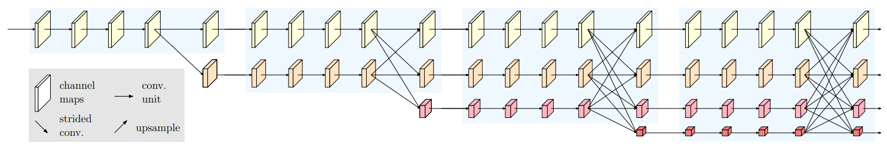

BoostCampAITECH
{:.note title="출처 및 참고"}

* this unordered seed list will be replaced by the toc
{:toc}

# HRNet의 필요성

image classification networks 발전 → LeNet, AlexNet, VGGNet, ResNet, EfficientNet

이미지 분류를 위한 CNN 구조는 **고해상도 입력을 점차 저해상도로 줄여가는 (LeNet의) 설계 방식을 사용하고 저해상도 high-level feature 를 이용해 (Upsampling, Decoder 등으로) segmentataion 결과를 생성**

**image classification 모델이 해상도를 점점 줄여나가는 이유**

- 특정 물체를 분류하는데 이미지 내 모든 특징이 필요하지 않음
- 해상도가 줄어들여 효율적인 연산이 가능하며, 각 픽셀이 넓은 receptive field를 갖게 됨
- 중요한 특징만을 추출하여 과적합 방지

**image classification vs semantic segmentation**

- 이미지 분류 모델은 공간적(spatial) 정보를 크게 고려하지 않음
- segmentation은 예측하려는 각 픽셀 주변의 context를 잘 파악하기 위해 공간 상의 위치 정보가 중요
- 중요 특징을 추출하기 위해 수행하는 pooling 등의 연산은 모덴 픽셀에 대해 정확히 분류하기에 자세한 정보를 유지하지 못함

semantic segmentation은 이미지 내 모든 픽셀에 대한 분류이므로 더 많고 자세한 정보가 필요하기 때문에, 높은 해상도를 유지하는 것이 좋음 그러므로 이미지 분류 모델을 그대로 사용해서 얻은 저해상도의 특징은 모든 픽셀에 대해 정확한 분류를 수행하기에는 부족한 정보를 가져서 **해상도를 높여 자세한 정보를 유지할 필요가 있음**

DeconvNet, SegNet, U-Net과 같이 **low resolution 특징을 생성하고, 다시 high resolution으로 복원하는 방식의 기존 연구**

- DeepLab
    - 넓은 receptive filed를 갖기 위해 down-sampling 후 convolution 사용한 결과 → sparse feature map 추출
    - 해상도를 적게 줄이면서 넓은 receptvie filed를 갖도록 dilated convolution을 사용한 결과 → dense feature map 추출
- DilatedNet, DeepLab
    - 해상도의 이점을 살리기 위함 → dilated convolution 적용
    - U-Net등의 구조와 달리 저해상도가 아닌 중해상도 정보를 고해상도로 복원
- DeepLab v3+
    - 자세한 정보를 유지하기 위해 Xception 구조 내 max pooling 연산을 depthwise separable convolution으로 변경
- DeconvNet, SegNet, U-Net
    - 여러 번의 pooling 연산을 통한 low resolution 정보 활용
- DilatedNet, DeepLab
    - Dilated Convolution 적용 또는 pooling 연산을 제거하여 medium resolution 정보를 활용

**Classification based Networks의 문제점**

- 기존 classification network 사용에 필요했던 높은 time complexity
- Upsampling을 이용해 저해상도로부터 고해상도로 복원하며 생성되는 특징은 공간 상에서 위치 정보의 민감도(position-sensitivity)가 낮음

→ 위 문제점들을 해결하기 위해 강력한 위치 정보를 갖는 visual recognition 문제에 적합한 구조가 필요함

**저해상도/중해상도를 고해상도로 복원하는 것이 아닌 고해상도 정보를 계속 유지하는 것 → HRNet(High Resolution Network)**

주로 image classification 문제에 사용되는 backbone network이 아닌 위치 정보가 중요한 visual recognition 문제(segmentation, object detection, pose estimation 등)에 사용할 수 있는 **새로운 backbone network**

# HRNet 구조

- **전체 과정에서 고해상도 특징을 계속 유지**
    - 입력 이미지의 해상도를 그대로 유지하는 것이 아닌, strided convolution을 이용해 해상도를 1/4로 줄임 **→ 전체 구조에서 1/4 해상도를 그대로 유지**
    - U-Net과 DeepLab v3+의 경우 해상도가 각각 1/20, 1/16으로 감소하는데 HRNet은 **다른 구조에 비해 상대적으로 높은 해상도를 유지**
- **고해상도부터 저해상도까지 다양한 해상도를 갖는 특징을 병렬적으로 연산(Parallel Multi-Resolution Convolution Stream)**
    
    
    
    
    
    - 고해상도 convolution stream을 시작으로 점차 해상도를 줄여 저해상도 stream을 새롭게 생성, 새로운 stream이 생성될 때 해상도는 이전 단계 해상도의 1/2로 감소함 → 해상도를 줄여 넓은 receptive filed를 갖는 특징은 고해상도 특징과 함께 학습
- **다중 해상도 정보를 반복적으로 융합(Repeated Multi-Resoluton Fusions)**
    
    
    
    
    
    - 고해상도 특징: 공간 상의 높은 정보 민감도(position-sensitivity)를 가짐
        - 고해상도 정보 → 저해상도 stream에 전달: Strided Convolution 연산(정보 손실을 최소화 하기 위해 pooling 대신 사용)
    - 저해상도 특징: 넓은 receptive filed로 인해 상대적으로 풍부한 의미 정보(semantic information)를 가짐
        - 저해상도 정보 → 고해상도 stream에 전달: Bilinear upsampling(Time complexity 고려해 convolution 대신 사용) 및 1x1 Convolution 연산(채널 수를 맞추기 위해)
- **다양한 종류의 출력 생성**
    
    
    
    - HRNetV1
        - 저해상도를 제외한 고해상도 특징만을 최종 출력으로 사용하고 Pose Estimation 문제에 활용
    - HRNetV2
        - 저해상도 특징들을 bilinear upsampling을 통해 고해상도 크기로 변환 후 모든 특징들을 합해서 출력하고 Semantic Segmenataion 문제에 활용
    - HRNetV2p
        - HRNetV2의 결과에서 추가로 down sampling한 결과를 출력하고 Faster-RCNN 등의 backbone으로 사용되어 Object Detection 문제에 활용

## 정리

1. **입력 이미지의 해상도를 1/4로 축소**
2. **1/4 해상도는 그대로 유지하면서 새로운 저해상도 stream을 생성하여서로의 정보들을 융합**
3. **모든 해상도 정보를 합한 후 원래 이미지 크기로 bilinear upsampling하여 최종 결과 출력**

# HRNet의 세부 구조 및 구현

**변수 C**: 가장 높은 해상도 stream의 채널 수(C)에 따라서 HRNetV2-W18, 32,40, 48

## 구현(**HRNet-48)**

**예시로 HRNet-48**

### **Steam**

- stride를 2로 적용하여 1/2로 축소를 두 번 → 입력 이미지 1/4로 축소

### Stage1

- 1x1 Conv → 3x3 Conv → 1x1 Conv로 구성된 연산을 4번 반복
- 첫 번째 block: 입력 채널(64)과 출력 채널(256)을 맞추기 위해서 skip connection에 1x1 Conv 추가
    
    
    
- 두번째 block ~ : 입력 채널(264)과 출력 채널(256) 동일
- 아래부터는 Strided Convolution으로 새로운 하위 stream 생성
    - 가장 높은 해상도 stream의 채널 수로 **48**로 설정
    - 새로운 stream의 해상도는 이전 단계 해상도의 1/2로 감소 및 채널 수는 2배 증가
    
    
    
    
    

### Stage2

2번의 3x3 Conv로 구성된 연산을 4번 반복하며 각 stream에 해당하는 해상도 및 채널 수(48, 96)을 유지

stage_block을 4번 반복

- Strided Convolution으로 하위 stream을 생성
- Bilinear upsampling 및 1x1 conv로 상위 stream 생성
- 새로운 stream의 해상도는 이전 단계의 해상도의 1/2로 감소 및 채널 수는 두 배 증가
    
    
    

HRNet 공식 구현은 논문의 그림과 달리 fuse 후 새로운 stream 생성 → 각 해상도 정보가 다른 모든 해상도 정보를 집계한다는 관점에서 두 구현 방법은 거의 동일하다고 저자가 말했다고…

- 논문에서는 bilinear upsampling 후 1x1 convolution으로 채널 수 변경했지만 공식  구현에서 computational complexity 감소 효과 때문에 1x1 Convolution으로 채널 수 변경 후 bilinear upsampling을 적용했음
- inputs_high + med2high, inputs_medium + high2med: sum임, concat(x)

첫 번째 및 두 번째 stream이 서로 fuse된 후, 두 번째 stream에서 strided convolution을 이용해 3번째 stream을 생성함

### Stage3

sateg2에서 사용한 block을 채널 수만 변경하여 동일하게 사용

1. 각각의 block을 4회 반복 및 다중 steram에 대해 fuse 수행
2. 위 1에서 수행한 연산을 동일하게 4번 반복
3. 마지막 4번째 반복 후 새로운 해상도 stream 생성
4. Stage2의 fuse와 동일하게
    
    
    
    - Strided Convolution으로 하위 stream 생성
    - Bilinear upsampling 및 1x1 Convolution으로 상위 stream 생성
    - 새로운 stream의 해상도는 이전 단계 해상도의 1/2로 감소 및 채널 수 2배
    - fuse 후 새로운 stream을 생성하고 두 구현 방법은 거의 동일

### Stage4

새로운 해상도 stream 추가 및 반복 횟수(4→3)를 제외하면 Stage3과 전반적으로 동일

1. 저해상도 특징을 bilinear upsampling 후 모든 특징 결합
2. 두 번의 1x1 conv 연산으로 최종 예측할 카테고리 수 만큼의 채널 생성
3. 원래 입력 이미지 크기(x4)로 bilinear upsampling하여 최종 출력 형성

# HRNet 실험 결과

Cityscape val Benchmark

- 모델 크기(#param.) 및 계산 복잡도(GFLOPs)에 따른 성능(mIoU) 비교
- 일반적인 classification network을 backbone으로 사용한 UNet++, DeepLabv3(+), PSPNet과 비교하여 HRNet을 사용해 더 작은 모델로 더 높은 성능 기록

