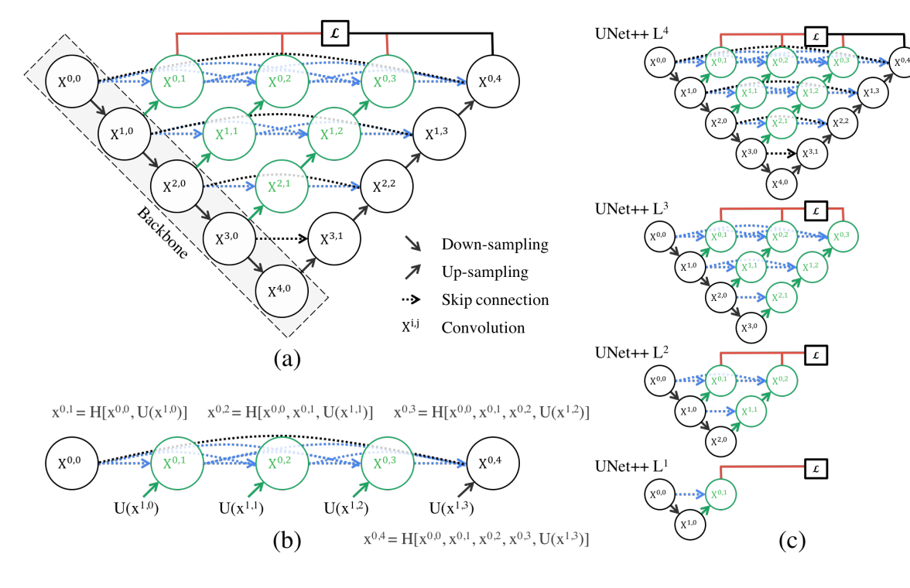

[U-Net++ paper](https://arxiv.org/pdf/1807.10165)
BoostCampAITECH
{:.note title="출처 및 참고"}

* this unordered seed list will be replaced by the toc
{:toc}

# Abstract

UNet처럼 Encoder-Decoder network를 가지고 있으며 re-designed skip pathways를 통해 encoder와 decoder의 sub-networks의 feature map 사이에 semantic gap을 reduce하는 것을 목표로 하였다.

저자는 encoder와 decoder의 feature map이 의미적으로 유사할 때 optimizer가 더 쉽게 학습 작업을 처리할 수 있다고 주장한다.

# Introduction

> a segmentation architecture basesd on nensted and dense skip connections
> 

image segmentation의 state-of-the-art 모델들은 encoder-decoder를 변형시킨 모델이 있다. 대표적으로 U-Net, FCN. 이러한 모델들의 key similarity가 skip connection이다.

natural image와 다르게 medical image에서의 병변이나 이상 부위를 segmentation하는 경우 정확한 진단을 위해서 high level의 정확도를 요구한다.

# Related Work

이전의 논문 중에서는 FCN, U-Net, DenseNet의 영감을 받은 H-DenseUNet, GridNet, MaskRCNN을 언급했다.

FCN, U-Net의 공통점으로 다시 skip connection을 이야기하면서 skip connection이 network output에서 the full spartial resolution을 recover하는 것에 도움을 준다는 것이 증명되었음을 언급한다.

H-DenseUNet는 short-skip connection을 도입했지만 아키텍처 간의 minor diffenreces에도 불구하고 결합하는 경향이 있어 성능을 저하로 이어질 수 있다고 한다.

최근의 논문 중 GridNet과 MaskNet, GridNet은 feature map이 격자 구조로 연결된 encoder-decoder 구조이지만 skip connection 사이의 up-sampling이 부족하여 UNet++을 대체하지는 못한다. Mask-RCNN은 object detection, segmentataion, classfication을 위한 meta framework 중 하나임을 언급하며 UNet++을 Mask-RCNN의 백본 아키텍처로 쉽게 적용이 가능하다.

# Proposed Network Architecuter: UNet++




U-Net과 구별한다면 re-designed skip pathways(green and blue), deep supervision(red)가 있다.

## Re-designed skip pathways

$$x^{i,j}$$는 노드 $$X^{i, j}$$를 나타내며 아래와 같이 계산된다.

- **i**: indexes the down-sampling layer along the encoder
- **j**: indexes the convolution layer of the dense block along the skip pathway
- **H()**: convolution operation followed by an activation function
- **U()**: up-sampling layer
- **[]**: concatenation layer


- **node at level j = 0 receive only one input** from the previous layer of the encoder
- **node at level j = 1 receive two inputs,**
    - both from the encoder sub-network but at two consecutive levels
- **nodes at level j > 1 receive j + 1 inputs**,
    - of which j inputs are the outputs of previous j nodes in the same skip pathway
    - and the last input is the up-sampled output from the lower pathway

top skip pathway를 통해 feature maps가 어떻게 전달되는지 그림 1b로 확인


## Deep supervision

deep supervision을 제안했고 모델이 2가지 mode로 동작할 수 있게 해준다.

1. **accurate mode**: wherein the outputs from all segmentation branches are averaged.
2. **fast mode**: wherein the final segmentation map is selected from only one of the segmentation branches, the choice of which determines the extent of model pruning and speed gain.


그림 1c를 통해 fast mode에서 어떤 segmentation branch를 사용하느냐에 따라서 모델 복잡도가 달라짐을 보여준다. UNet과 다르게 skip pathways에 Encoder와 Decoder의 feature map 사이에 있는 semantic gap을 연결해주는 convolution layer가 존재하므로 branch 단위로 쪼갤 수 있다.

loss function을 binary cross-entropy와 dice coefficient를 융합해서 사용한다.


# Experiments

4가지 데이터 셋을 사용하였으며 U-Net과 wide U-Net로 비교했다.


# 구현

```python
# 출처 : https://jinglescode.github.io/2019/12/02/biomedical-image-segmentation-u-net-nested/

class conv_block_nested(nn.Module):
    def __init__(self, in_ch, mid_ch, out_ch):
        super(conv_block_nested, self).__init__()
        self.activation = nn.ReLU(inplace=True)
        self.conv1 = nn.Conv2d(in_ch, mid_ch, kernel_size=3, padding=1, bias=True)
        self.bn1 = nn.BatchNorm2d(mid_ch)
        self.conv2 = nn.Conv2d(mid_ch, out_ch, kernel_size=3, padding=1, bias=True)
        self.bn2 = nn.BatchNorm2d(out_ch)

    def forward(self, x):
        x = self.conv1(x)
        x = self.bn1(x)
        x = self.activation(x)

        x = self.conv2(x)
        x = self.bn2(x)
        output = self.activation(x)
        return output

class UNetPlusPlus(nn.Module):
    def __init__(self, in_ch=3, out_ch=1, n1=64, height=512, width=512, supervision=True):
        super(UNetPlusPlus, self).__init__()

        filters = [n1, n1 * 2, n1 * 4, n1 * 8, n1 * 16]

        self.pool = nn.MaxPool2d(kernel_size=2, stride=2)
        self.Up = nn.ModuleList([nn.Upsample(size=(height//(2**c), width//(2**c)), mode='bilinear', align_corners=True) for c in range(4)])
        self.supervision = supervision

        self.conv0_0 = conv_block_nested(in_ch, filters[0], filters[0])
        self.conv1_0 = conv_block_nested(filters[0], filters[1], filters[1])
        self.conv2_0 = conv_block_nested(filters[1], filters[2], filters[2])
        self.conv3_0 = conv_block_nested(filters[2], filters[3], filters[3])
        self.conv4_0 = conv_block_nested(filters[3], filters[4], filters[4])

        self.conv0_1 = conv_block_nested(filters[0] + filters[1], filters[0], filters[0])
        self.conv1_1 = conv_block_nested(filters[1] + filters[2], filters[1], filters[1])
        self.conv2_1 = conv_block_nested(filters[2] + filters[3], filters[2], filters[2])
        self.conv3_1 = conv_block_nested(filters[3] + filters[4], filters[3], filters[3])

        self.conv0_2 = conv_block_nested(filters[0]*2 + filters[1], filters[0], filters[0])
        self.conv1_2 = conv_block_nested(filters[1]*2 + filters[2], filters[1], filters[1])
        self.conv2_2 = conv_block_nested(filters[2]*2 + filters[3], filters[2], filters[2])

        self.conv0_3 = conv_block_nested(filters[0]*3 + filters[1], filters[0], filters[0])
        self.conv1_3 = conv_block_nested(filters[1]*3 + filters[2], filters[1], filters[1])

        self.conv0_4 = conv_block_nested(filters[0]*4 + filters[1], filters[0], filters[0])

        self.seg_outputs = nn.ModuleList([nn.Conv2d(filters[0], out_ch, kernel_size=1, padding=0) for _ in range(4)])

    def forward(self, x):
        seg_outputs = []
        x0_0 = self.conv0_0(x)
        x1_0 = self.conv1_0(self.pool(x0_0))
        x0_1 = self.conv0_1(torch.cat([x0_0, self.Up[0](x1_0)], 1))
        seg_outputs.append(self.seg_outputs[0](x0_1))

        x2_0 = self.conv2_0(self.pool(x1_0))
        x1_1 = self.conv1_1(torch.cat([x1_0, self.Up[1](x2_0)], 1))
        x0_2 = self.conv0_2(torch.cat([x0_0, x0_1, self.Up[0](x1_1)], 1))
        seg_outputs.append(self.seg_outputs[1](x0_2))

        x3_0 = self.conv3_0(self.pool(x2_0))
        x2_1 = self.conv2_1(torch.cat([x2_0, self.Up[2](x3_0)], 1))
        x1_2 = self.conv1_2(torch.cat([x1_0, x1_1, self.Up[1](x2_1)], 1))
        x0_3 = self.conv0_3(torch.cat([x0_0, x0_1, x0_2, self.Up[0](x1_2)], 1))
        seg_outputs.append(self.seg_outputs[2](x0_3))

        x4_0 = self.conv4_0(self.pool(x3_0))
        x3_1 = self.conv3_1(torch.cat([x3_0, self.Up[3](x4_0)], 1))
        x2_2 = self.conv2_2(torch.cat([x2_0, x2_1, self.Up[2](x3_1)], 1))
        x1_3 = self.conv1_3(torch.cat([x1_0, x1_1, x1_2, self.Up[1](x2_2)], 1))
        x0_4 = self.conv0_4(torch.cat([x0_0, x0_1, x0_2, x0_3, self.Up[0](x1_3)], 1))
        seg_outputs.append(self.seg_outputs[3](x0_4))

        if self.supervision:
            return seg_outputs
        else:
            return seg_outputs[-1]
```