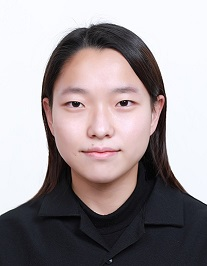

## 👋 Contact
---
**💌 Email**: [faye_1221@naver.com](mailto:faye_1221@naver.com)  
**🖊️ Tech Blog**: [faye-1221.github.io](https://faye-1221.github.io/)  
**🧑‍💻 GitHub**: [faye-1221](https://github.com/faye-1221)

## 🙋🏻 How I work
---
- 항상 **더 나은 내가 되기 위해** 끊임없이 발전하고 노력합니다.
- **긍정적인 영향**을 주는 일은 저에게 큰 동기부여가 됩니다.
- **맡은 일에 항상 최선**을 다하며, **정해진 기한**을 반드시 지키려합니다.

## 🔎 Profile
### 📖  교육 | Edcation
- **국립공주대학교** 2020.03 - 2025.02(졸업예정)
    - 주전공: 컴퓨터공학부 컴퓨터공학전공
    - 부전공: 응용수학과
- **부스트캠프 AI TECH 6기[네이버 커넥트 재단]** 2023.11 - 2024.04(수료)

### 📜 자격증 | License
- **정보처리기사 [2024. 09. 10, 한국산업인력공단]**
- **빅데이터분석기사 필기 [2024. 09. 27, 한국데이터산업진흥원]**
    - 2024.11.30 실기 예정

### 🏆 수상 | Prize
- **우수 논문상(은상) [2022. 12. 02, 한국정보기술학회 대학생 논문경진대회]**
    - 논문명: ‘영상인식에서 전처리 유무 및 환경변화에 따른 객체 인식률 비교’

### 🏙️ 경력 | Career
- **(주)에이리스, 동계 방학 인턴십 프로그램 [2023.01 - 2023.02]**
    - 위험 물품 X-ray 데이터셋 구축
    - 모델 평가를 위한 Metrics Python 코드 작성 및 Mask-RCNN fine-tuning